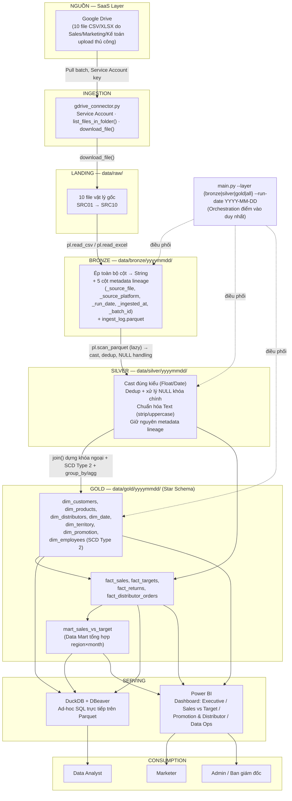

# VietDist Analytics Platform — Solution Architecture Blueprint

**Loại tài liệu:** Technical Design Document (TDD) — Kiến trúc kỹ thuật toàn diện
**Vai trò biên soạn:** Senior Solution Architect / Principal Data Engineer (mô phỏng, phản biện kỹ thuật)
**Phạm vi:** Bronze → Silver → Gold Lakehouse cho VietDist (nhà phân phối FMCG)
**Trạng thái:** v1.0 — dùng để bàn giao cho đội Data Engineer bắt đầu code (tham chiếu chi tiết acceptance criteria tại `phase1_bronze_ingestion.md`, `phase2_silver_cleansing.md`, `phase3_gold_production.md`, và use-case/BRD tại `docs/BRD_Solution_Architecture.md`)
**Ngày:** 2026-07-27

---

## BƯỚC 1 — Tóm tắt Đầu vào / Đầu ra

VietDist là nhà phân phối FMCG vận hành qua mạng lưới distributor và sales rep trải khắp vùng miền, nhưng toàn bộ dữ liệu Sales/Marketing/Kế toán hiện nằm rải rác trên 10 file Excel/CSV do từng phòng ban tự upload thủ công lên Google Drive — không có single source of truth, báo cáo dựng tay bằng VLOOKUP mất nhiều giờ/tuần và không thể truy vết khi số liệu sai. Nỗi đau cốt lõi cần giải quyết: (1) dữ liệu phân mảnh, không chuẩn hóa, (2) không tách bạch raw/clean/reporting nên một lỗi ở nguồn kéo theo làm lại toàn bộ báo cáo tay, (3) không có lineage để audit, (4) không đo được ROI khuyến mãi và không so sánh được doanh số thực tế và target theo vùng một cách tự động. Đầu ra mong đợi là một Data Lakehouse tự động hóa hoàn toàn theo kiến trúc Medallion (Bronze/Silver/Gold), sản xuất ra một Star Schema duy nhất, idempotent, có lineage đầy đủ, chạy qua một lệnh CLI duy nhất và phục vụ trực tiếp cho DuckDB (ad-hoc SQL) và Power BI (dashboard tự phục vụ) mà không cần đội DE can thiệp thủ công cho từng báo cáo.

---

## BƯỚC 2 — Source Analysis (Phân tích nguồn dữ liệu)

### 2.1 Source Inventory

Toàn bộ 10 nguồn hiện tại đến từ **một điểm vào duy nhất**: thư mục dùng chung trên Google Drive, do con người upload thủ công. Đây là điểm quan trọng nhất chi phối toàn bộ thiết kế phía sau — không có OLTP database, không có webhook, không có event stream.

| Nguồn | Loại hệ thống | Phương thức trích xuất | Tần suất | Xử lý ban đầu sau khi nạp |
|---|---|---|---|---|
| SRC01 `sales_transactions.csv` | File-based (SaaS Drive) | Pull qua Google Drive API (Service Account) → batch download | Hàng ngày | Landing thô vào `data/raw/`, ép String, gắn metadata → Bronze |
| SRC02 `sales_target_plan.xlsx` | File-based, có versioning nội bộ (`plan_version`, `effective_from/to`) | Pull Drive API | Hàng tháng | Bronze giữ nguyên version-history, không merge sớm |
| SRC03 `customer_master.csv` | File-based, dạng "master" full-snapshot | Pull Drive API | Khi có KH mới/đổi | Bronze giữ mọi bản upload; khử trùng lặp xử lý ở Silver |
| SRC04 `product_master.xlsx` | File-based master | Pull Drive API | Khi ra mắt/ngưng SP | Bronze |
| SRC05 `distributor_orders.xlsx` | File-based transaction | Pull Drive API | Hàng ngày | Bronze |
| SRC06 `distributor_master.csv` | File-based master | Pull Drive API | Khi có NPP mới | Bronze |
| SRC07 `employee_master.xlsx` | File-based, **loại slowly-changing** (`version`, `effective_date`) | Pull Drive API | Khi thay đổi vị trí/vùng | Bronze giữ đủ history → Gold dựng SCD Type 2 |
| SRC08 `territory_mapping.xlsx` | File-based bridge/mapping theo kỳ hiệu lực | Pull Drive API | Khi đổi phân vùng | Bronze |
| SRC09 `return_transactions.csv` | File-based transaction | Pull Drive API | Hàng ngày | Bronze |
| SRC10 `promotion_program.xlsx` | File-based master theo chương trình | Pull Drive API | Khi mở/đóng chương trình | Bronze |

**Nhận định kiến trúc:** vì cả 10 nguồn đều là file tĩnh qua cùng một connector, không có lý do kỹ thuật để dựng 10 pipeline riêng biệt hay 10 connector khác nhau — thiết kế đúng là **một connector generic (`gdrive_connector.py`) + một vòng lặp ingest tham số hóa theo `SRC0x`**, không phải 10 pipeline độc lập. Đây là quyết định giảm technical debt ngay từ Bronze.

**Định hướng mở rộng nguồn (ngoài phạm vi 3 phase hiện tại, nhưng kiến trúc phải chừa chỗ):** khi VietDist trưởng thành hơn, các nguồn tiếp theo nhiều khả năng sẽ là ERP/OLTP (đơn hàng real-time), POS của distributor, hoặc SaaS CRM — lúc đó cần thêm connector loại CDC/REST API riêng, KHÔNG tái sử dụng logic Drive connector. Interface Bronze (contract 5 cột metadata) phải được thiết kế đủ tổng quát để tiếp nhận nguồn mới mà không phá vỡ Silver/Gold phía sau.

### 2.2 Data Characteristics & Quality

| Trục | Đánh giá | Hệ quả thiết kế |
|---|---|---|
| **Schema stability** | THẤP. File Excel/CSV do người upload tay — rủi ro đổi tên cột, thêm sheet, merge cell, đổi thứ tự cột giữa các lần upload | Bronze phải ép **toàn bộ về String** (schema-on-write tối giản) để không sập pipeline vì lỗi kiểu; validate kiểu chỉ thực hiện ở Silver nơi có thể xử lý lỗi có kiểm soát |
| **Volume** | THẤP–TRUNG BÌNH (quy mô SME, 10 file/ngày, ước tính hàng nghìn–hàng chục nghìn dòng/file). Không phải Big Data | Không cần compute phân tán (Spark/cluster). Single-node columnar engine (Polars + Parquet) là đủ và tối ưu chi phí |
| **Velocity** | Batch, tần suất ngày/tháng — KHÔNG có yêu cầu real-time | Loại bỏ hoàn toàn nhu cầu streaming (Kafka/Kinesis) khỏi phạm vi thiết kế |
| **Định dạng** | Structured (CSV) và bán-cấu-trúc (XLSX nhiều sheet, merge cell, định dạng số theo locale VN) | Cần engine đọc Excel chịu lỗi tốt (Polars + `fastexcel`); không thể coi XLSX tương đương CSV |
| **Rủi ro DQ điển hình** | (1) Trùng lặp `customer_master` do upload lại file cũ (xác nhận thực tế); (2) NULL `tax_code` ở `employee_master`; (3) số tiền dạng string có dấu phân cách nghìn (`1,000,000`) gây lỗi cast thẳng; (4) lệch múi giờ ở cột ngày; (5) khóa ngoại mồ côi khi nhân viên đổi vùng nhưng fact vẫn tham chiếu vùng cũ; (6) không có cơ chế phát hiện DELETE/UPDATE ở nguồn (full-file reload, không CDC) | Silver bắt buộc: dedup theo full-row, xử lý NULL khóa chính, `str.replace_all(",", "")` trước khi cast Float, chuẩn hóa Date/Timezone. Gold bắt buộc: SCD Type 2 cho `dim_employees` để tránh sai lệch lịch sử khi join theo `order_date` |

### 2.3 Core Dimensions & Metrics (bắt buộc cho báo cáo lãnh đạo)

**Dimensions bắt buộc:** `dim_date`, `dim_customers`, `dim_products`, `dim_distributors`, `dim_territory`, `dim_promotion`, và `dim_employees` (SCD Type 2 — bắt buộc vì bài toán "doanh số theo đúng nhân viên/vùng tại thời điểm phát sinh đơn hàng" không giải được bằng snapshot hiện tại).

**Metrics bắt buộc** (ánh xạ trực tiếp từ yêu cầu Ban giám đốc/Marketer trong BRD mục 4.2):

| Nhóm | Metric | Vì sao bắt buộc |
|---|---|---|
| Doanh số | Revenue thực tế, Growth MoM/YoY | Câu hỏi nền tảng nhất của mọi báo cáo điều hành |
| Target | Achievement rate, Variance theo vùng/tháng | Chính là yêu cầu gốc của dự án ("Doanh số thực tế so với Target theo từng vùng") |
| Khuyến mãi | Promotion Uplift, Promotion ROI | Giải quyết pain point "không đo được ROI khuyến mãi" |
| Distributor | Fill Rate, On-time Delivery % | Đo hiệu suất chuỗi cung ứng, không thể suy ra nếu không có `fact_distributor_orders` |
| Khách hàng | Return Rate | Cảnh báo chất lượng sản phẩm/vận hành |
| Nhân sự | Doanh số/nhân viên theo đúng vùng lịch sử | Chỉ tính đúng được nếu có SCD Type 2 |
| Vận hành | Pipeline Success Rate | Bắt buộc với vai trò Admin — không có observability thì không vận hành được production |

---

## BƯỚC 3 — Quyết định ETL vs ELT

### 3.1 Hai hướng khả thi

**ETL cổ điển** (Extract → Transform → Load):
```
Google Drive → [Transform engine: cast/dedup/join/model NGAY khi đọc] → Load thẳng vào Data Warehouse (chỉ bảng đã sạch/đã model)
```
Raw data KHÔNG được lưu bền; nếu logic transform sai hoặc thay đổi, phải quay lại nguồn gốc (Drive) để chạy lại từ đầu — nhưng Drive không giữ version lịch sử đáng tin cậy.

**ELT / Medallion Lakehouse** (Extract → Load raw → Transform nhiều bước):
```
Google Drive → Load nguyên trạng (Bronze, String) → Transform lần 1: clean/cast/dedup (Silver) → Transform lần 2: model hóa Star Schema (Gold)
```
Raw data luôn được lưu bền ở Bronze; mọi transform là **có thể replay** từ Bronze bất cứ lúc nào.

### 3.2 Lựa chọn: **ELT (Medallion, Load-first)**

Lý do quyết định, không mơ hồ:

1. **Nguồn dữ liệu không đáng tin cậy về schema/chất lượng** (file người dùng tự upload). ETL cổ điển transform-in-flight nghĩa là nếu logic transform sai một lần, dữ liệu raw đã mất — không có cách nào audit lại "số liệu gốc trước khi transform là gì". Với dạng nguồn rủi ro cao thế này, giữ raw là bắt buộc, không phải tùy chọn.
2. **Yêu cầu lineage/audit là yêu cầu cứng của BRD** (US-02, US-08, UC-09) — chỉ ELT với lớp Bronze bất biến mới trả lời được câu hỏi "batch nào, file nào, lúc nào" mà không cần hệ thống log ngoài.
3. **Idempotency** (yêu cầu xuyên suốt cả 3 phase) tự nhiên hơn nhiều trong mô hình ELT theo partition ngày — chạy lại chỉ ghi đè đúng thư mục `yyyymmdd`, không phụ thuộc trạng thái transform phức tạp.
4. Compute rẻ (Polars single-node, Parquet columnar) khiến việc "Load rồi Transform nhiều lần" gần như không tốn thêm chi phí đáng kể so với transform một lần — lợi ích governance vượt xa chi phí biên.

### 3.3 Trade-off chi tiết

| Tiêu chí | ETL cổ điển | ELT/Medallion (đã chọn) |
|---|---|---|
| **Latency** | Nhanh hơn về lý thuyết (ít bước ghi) nhưng vô nghĩa ở đây vì cả hệ thống chạy batch ngày, không có SLA phút/giây | Có thêm 2 bước ghi (Bronze, Silver) trước Gold — độ trễ cộng thêm là vài giây–phút cho volume MB-GB hiện tại, chấp nhận được hoàn toàn |
| **Chi phí hạ tầng/vận hành** | Thấp hơn nếu tính storage (không lưu raw) NHƯNG rủi ro vận hành cao hơn (không debug được khi sai) | Storage tăng nhẹ (raw String Parquet vẫn nén tốt, không phải CSV thô) — chi phí gần như 0 vì chạy local/Parquet nén, đổi lại giảm hẳn chi phí incident-response |
| **Team skillset** | Đòi hỏi viết transform logic "đúng ngay từ lần đầu" vì không có lưới an toàn raw layer — rủi ro cao với đội 1 fresher DE | Cho phép sai và sửa lại Silver/Gold nhiều lần mà không lo mất dữ liệu gốc — phù hợp năng lực đội hiện tại (đang học, sẽ có bug) |
| **Tận dụng Lakehouse hiện đại** | Không tận dụng được thế mạnh cột (columnar) của Parquet cho nhiều lớp — chỉ có 1 lớp thành phẩm | Đúng tinh thần Lakehouse: DuckDB/Power BI có thể query cả Silver lẫn Gold khi cần debug số liệu, không chỉ Gold |

**Kết luận:** ELT theo kiến trúc Medallion 3 lớp là lựa chọn đúng cho quy mô, độ tin cậy nguồn, và năng lực đội hiện tại — không phải vì "xu hướng hiện đại" mà vì nó trực tiếp giải quyết pain point lineage/idempotency nêu trong BRD.

**Lưu ý về công cụ thực thi:** đây là ELT về mặt *triết lý kiến trúc* (Load raw trước, Transform nhiều lần sau, mỗi lớp được materialize), nhưng công cụ transform là **Polars (compute engine Python)**, không phải SQL chạy trong một Data Warehouse như dbt thường làm. Lý do và trade-off của quyết định này nằm ở Bước 5.

---

## BƯỚC 4 — Quyết định Mô hình Hạ tầng

### 4.1 Phân tích các phương án

| Phương án | Mô tả | Phù hợp? |
|---|---|---|
| **Cloud-native đầy đủ** (AWS S3+Glue+Athena, GCP GCS+BigQuery, Azure ADLS+Synapse) | Toàn bộ storage/compute/orchestration chạy trên cloud managed service | KHÔNG phù hợp ở giai đoạn hiện tại |
| **On-Premises thuần** | Toàn bộ chạy trên máy chủ/laptop nội bộ, không phụ thuộc SaaS nào | Không khả thi tuyệt đối — vì nguồn dữ liệu ĐANG nằm trên Google Drive (SaaS), không thể "on-prem hóa" điểm vào |
| **Hybrid thực dụng ("SaaS Source + Local/Single-node Compute")** | Nguồn (Google Drive) là SaaS, nhưng toàn bộ storage/compute Lakehouse (Bronze/Silver/Gold, DuckDB) chạy local/single-node, không đẩy lên cloud DW | **ĐỀ XUẤT** |

### 4.2 Lập luận bảo vệ lựa chọn: Hybrid thực dụng (SaaS-source, local-compute)

- **OpEx vs CapEx:** VietDist là SME, chưa có ngân sách hạ tầng cloud DW cố định và chưa có đội hạ tầng riêng. Chạy Bronze/Silver/Gold trên local filesystem + Parquet + DuckDB có OpEx gần bằng 0 (không trả phí compute/storage cloud theo giờ), trong khi CapEx cũng gần 0 (không cần mua server). Đây là điểm quyết định lớn nhất: **volume dữ liệu (MB–GB/ngày) không đủ lớn để cloud DW hoàn vốn chi phí vận hành** (network egress, cluster warm-up, license BI connector...).
- **Security & Compliance:** Dữ liệu chứa PII ở mức trung bình (`phone`, `address`, `tax_code` của khách hàng/NPP) — chịu điều chỉnh của Nghị định 13/2023/NĐ-CP về bảo vệ dữ liệu cá nhân tại Việt Nam, KHÔNG phải GDPR/HIPAA/PCI-DSS (không xử lý dữ liệu y tế, không xử lý thẻ thanh toán trực tiếp). Yêu cầu compliance thực tế chỉ ở mức: kiểm soát truy cập `credentials.json` (Service Account key), không public dữ liệu khách hàng ra ngoài. Điều này **không đòi hỏi** hạ tầng cloud enterprise-grade (KMS, VPC, IAM phức tạp) — kiểm soát bằng `.gitignore` + biến môi trường `.env` là đủ tương xứng với mức rủi ro hiện tại. Cloud-native đầy đủ ở giai đoạn này là **over-engineering bảo mật** so với rủi ro thực tế, tốn effort mà không tăng tương xứng giá trị.
- **Scalability/HA:** Đây là điểm yếu thật sự của phương án hiện tại — chạy single-node nghĩa là **không có High Availability**, không có DR, và bị giới hạn bởi RAM máy chạy (Polars là in-memory engine dù có lazy evaluation). Rủi ro này được **chấp nhận có ý thức** ở quy mô hiện tại (batch ngày, không SLA uptime), nhưng phải được nêu rõ ràng như một **giới hạn kiến trúc có điều kiện scale**, không phải điểm mù.
- **Vì sao loại các phương án còn lại:**
  - *On-Prem thuần* bị loại vì không tương thích vật lý với nguồn dữ liệu (Drive là SaaS, không thể ép về on-prem mà không thay đổi hành vi nghiệp vụ của phòng Sales/Marketing/Kế toán — chi phí thay đổi quy trình con người còn lớn hơn chi phí hạ tầng).
  - *Cloud-native đầy đủ* bị loại vì: (a) chi phí vận hành cloud DW (BigQuery/Snowflake/Redshift) tính theo compute/storage sẽ vượt xa giá trị mang lại ở volume MB-GB/ngày; (b) đội ngũ hiện tại (1 DE) chưa có năng lực vận hành IAM/network/cost-governance cloud một cách an toàn — triển khai vội sẽ tạo rủi ro misconfiguration (bucket public, over-provision) cao hơn lợi ích.

**Điều kiện kích hoạt (trigger) để chuyển sang Cloud-native:** khi xảy ra **một trong** các điều kiện sau — (1) volume vượt khả năng RAM single-node xử lý ổn định bằng Polars, (2) cần nhiều analyst truy vấn đồng thời (DuckDB single-node không có concurrency/RBAC thật sự), (3) yêu cầu SLA uptime/DR chính thức từ Ban giám đốc, (4) số lượng nguồn dữ liệu tăng vượt khả năng một connector/CLI đơn lẻ quản lý — lúc đó nâng cấp Gold layer lên BigQuery/Snowflake, orchestration lên Airflow managed (Cloud Composer/MWAA), giữ nguyên Bronze/Silver logic (Polars transform logic chuyển sang dbt tương đối trực tiếp vì đã có contract Star Schema rõ ràng).

---

## BƯỚC 5 — Tech Stack & Architecture (Thiết kế chi tiết)

### 5.1 Tech Stack theo từng lớp

| Lớp | Công nghệ chọn | Vai trò cụ thể |
|---|---|---|
| **Ingestion / Data Capture** | Google Drive API v3 + Service Account (`gdrive_connector.py`), Python `google-api-python-client` | List + pull file batch từ thư mục dùng chung; xác thực bằng key JSON, không OAuth interactive (phù hợp chạy tự động, không người ngồi login) |
| **Storage / Raw / Landing** | Local filesystem, `data/raw/` (file vật lý gốc) → `data/bronze/yyyymmdd/` (Parquet, String-only, partition theo ngày) | Landing zone bất biến, an toàn kiểu dữ liệu, idempotent theo partition |
| **Transformation / Data Modeling** | Polars (Lazy API: `scan_parquet` → `collect` chỉ ở bước cuối), thực thi qua `main.py` | Cast kiểu, dedup, xử lý NULL, join dựng Star Schema, SCD Type 2 bằng `shift()`/`over()` |
| **Data Lakehouse (Warehouse thay thế)** | Parquet (columnar, nén, giữ schema) làm storage format ở cả 3 lớp; **DuckDB** làm query engine ảo hóa warehouse trên Parquet | Không cần server DB — DuckDB embedded, chạy trực tiếp trên file, zero-ops |
| **Serving / BI / Analytics** | Power BI (kết nối trực tiếp Gold Parquet/DuckDB) cho Marketer/BGĐ; DBeaver + DuckDB SQL cho Data Analyst ad-hoc | Tách rõ 2 nhu cầu: dashboard cố định vs truy vấn tùy biến |
| **Orchestration** | CLI đơn nhất `main.py` (Python `argparse`, tham số `--layer {bronze,silver,gold,all}`, `--run-date`) | Orchestration tối giản, tuyến tính 3 bước, không cần scheduler engine riêng ở quy mô hiện tại |
| **Data Quality / Testing** | `pytest` (`test_pipeline.py`) — test logic Data Mart và logic SCD Type 2 | Kiểm chứng transform logic đúng trước khi merge, không phải "chạy ra số là xong" |
| **Observability** | `ingest_log.parquet` tự dựng (`batch_id, source_file, rows_loaded, status, duration_sec`) | Observability tối thiểu nhưng đủ trả lời "batch nào lỗi, đọc bao nhiêu dòng, mất bao lâu" |
| **Secrets Management** | `.env` (biến trỏ đường dẫn key) + `.gitignore` chặn `credentials.json` | Ngăn rò rỉ Service Account key ra Git/GitHub |
| **Dependency Management** | `uv` + `pyproject.toml` | Môi trường reproducible, tách biệt dependency theo project |

### 5.2 Biện luận phản biện — vì sao KHÔNG chọn phương án khác

**Polars vs Pandas vs Spark**
Pandas: đơn luồng, bị giới hạn GIL, chậm hơn đáng kể ở thao tác join/group_by trên vài trăm nghìn–triệu dòng — không tận dụng được multi-core của máy hiện đại. Spark: overkill tuyệt đối — cần JVM, cluster (dù chạy local mode vẫn nặng), đường cong học tập cao, và đội 1 người không có nhu cầu lẫn năng lực vận hành Spark cluster cho khối lượng dữ liệu MB-GB. Polars: engine Rust đa luồng, Lazy API tối ưu query plan tự động, cú pháp gần SQL/Pandas nên dễ tiếp cận với dev Python, chạy tốt trên một máy — đúng "sweet spot" cho quy mô và năng lực đội hiện tại.

**DuckDB vs BigQuery / Snowflake / Redshift**
Ba lựa chọn cloud DW đều yêu cầu: tài khoản cloud, chi phí compute/storage theo giờ hoặc theo query, cấu hình IAM, và một đường ống nạp dữ liệu riêng (Load job) vào warehouse. Ở volume hiện tại (MB-GB/ngày, 10 nguồn), chi phí vận hành ba nền tảng này (kể cả ở tier miễn phí) vượt xa lợi ích vì: (1) không có nhu cầu concurrency cao, (2) không có nhu cầu compute phân tán thực sự. DuckDB chạy embedded trực tiếp trên Parquet, zero server, zero chi phí, và cho tốc độ OLAP tương đương ở quy mô này. **Đánh đổi chấp nhận:** DuckDB không có RBAC/multi-user concurrency cấp production, không có HA — chấp nhận được vì đối tượng dùng là 1-3 Data Analyst nội bộ, không phải hệ thống multi-tenant. Khi số lượng người dùng đồng thời hoặc volume tăng vượt ngưỡng, đây chính là điểm chuyển sang BigQuery/Snowflake đã nêu ở Bước 4.

**dbt vs Stored Procedures vs Polars scripts**
dbt phát huy sức mạnh khi transform logic sống *bên trong* một Data Warehouse đang chạy (SQL models, đội nhiều Analyst cùng cộng tác, cần incremental models + auto-lineage graph). Ở kiến trúc này, transform KHÔNG chạy trong một warehouse thường trực — nó chạy file-to-file (Bronze Parquet → Silver Parquet → Gold Parquet) bằng một compute engine Python. `dbt-duckdb` tồn tại nhưng chưa đủ trưởng thành cho workflow "ghi lại toàn bộ file Parquet theo partition ngày" kiểu này, và quan trọng hơn: bài toán SCD Type 2 (window function `shift()`/`over()` theo logic nghiệp vụ tùy biến) và ép kiểu an toàn theo từng nguồn lỗi khác nhau **cần control-flow cấp Python**, viết bằng SQL thuần trong dbt sẽ dài dòng và khó đọc hơn. Stored Procedures bị loại hoàn toàn vì không có Database Server thường trực nào để chứa chúng. **Đánh đổi chấp nhận:** mất đi lineage graph tự động và docs-as-code mà dbt cho miễn phí — bù lại bằng 5 cột metadata lineage thủ công + `ingest_log`. Khi đội DE scale lên >2 người và cần collaborate trên SQL model dùng chung, đây là candidate hợp lý để migrate.

**Managed Connectors (Fivetran/Airbyte) vs Custom `gdrive_connector.py`**
Managed connector hợp lý khi cần đồng bộ hàng chục nguồn SaaS đa dạng (Salesforce, HubSpot, Stripe...) với chi phí duy trì auth/pagination/schema-evolution cao. Ở đây chỉ có **một** loại nguồn (Google Drive, một thư mục, 10 file cố định) — chi phí license/setup Fivetran/Airbyte cho một use case hẹp như vậy không tương xứng. Custom connector ~150 dòng code, dùng thư viện chính thức của Google, kiểm soát hoàn toàn logic tải/retry. **Đánh đổi chấp nhận:** đội tự chịu trách nhiệm bảo trì khi Google Drive API thay đổi — chấp nhận được vì API này ổn định và ít thay đổi breaking.

**Airflow/Dagster vs CLI đơn (`argparse`)**
Airflow/Dagster hợp lý khi có: nhiều DAG phụ thuộc chéo, cần retry/alerting per-task, cần lịch chạy phức tạp, hoặc nhiều pipeline khác nhau chia sẻ hạ tầng scheduler. Ở đây có đúng 3 bước tuyến tính (Bronze → Silver → Gold) chạy 1 lần/ngày — đứng thêm một scheduler engine (kèm metadata DB riêng, webserver, cần người vận hành) là chi phí vận hành không cân xứng với độ phức tạp thật của bài toán. CLI với `argparse` đủ để điều phối, dễ debug (chạy trực tiếp trong terminal), dễ nhúng vào cron hoặc CI sau này. **Lộ trình nâng cấp rõ ràng:** khi có ≥2 pipeline độc lập cần điều phối chéo hoặc cần alerting tự động khi fail, bọc nguyên `main.py --layer all` vào 1 Airflow DAG (BashOperator/PythonOperator) — không cần viết lại logic transform.

**Great Expectations/Monte Carlo vs `pytest` + `ingest_log`**
GX/Monte Carlo mạnh ở việc profiling thống kê tự động và phát hiện anomaly trên nhiều bảng/nhiều pipeline liên tục — chi phí setup (expectation suites, data docs, alerting integration) chỉ hoàn vốn khi số nguồn/tốc độ thay đổi schema đủ lớn để việc viết test tay không theo kịp. Với 10 nguồn cố định, tốc độ thay đổi thấp, `pytest` (kiểm chứng logic transform: Data Mart đúng công thức, SCD Type 2 đúng `valid_to`) kết hợp `ingest_log` (observability vận hành: rows_loaded/status/duration) phủ được phần lớn giá trị với chi phí gần bằng 0. **Điểm kích hoạt đầu tư GX:** khi số nguồn dữ liệu tăng đủ nhiều để rủi ro schema drift vượt khả năng viết test thủ công theo kịp.

### 5.3 End-to-End Architecture Flow



**Ranh giới lớp (layer boundary) then chốt:**
- **Raw → Bronze:** ranh giới an toàn kiểu dữ liệu — mọi thứ vào Bronze đều là String, không có logic nghiệp vụ nào chạy ở đây ngoài gắn metadata. Đây là "insurance layer" chống pipeline sập vì lỗi kiểu từ nguồn.
- **Bronze → Silver:** ranh giới chất lượng dữ liệu — nơi duy nhất được phép cast kiểu, dedup, xử lý NULL. Silver là "single source of truth đã làm sạch" nhưng CHƯA model hóa quan hệ.
- **Silver → Gold:** ranh giới mô hình hóa nghiệp vụ — nơi duy nhất được phép `join()` để tra cứu surrogate key, dựng SCD Type 2, và tính toán Data Mart. Gold là contract cuối cùng với tầng BI, không được thay đổi ngược lên Silver.
- **Gold → Serving:** ranh giới tiêu dùng — DuckDB/Power BI chỉ đọc, không ghi ngược Lakehouse; đảm bảo Lakehouse là nguồn ghi duy nhất (single writer), tránh xung đột.

---

## Tổng kết quyết định kiến trúc (Architecture Decision Log)

| # | Quyết định | Vì sao | Điều kiện thay đổi |
|---|---|---|---|
| ADR-01 | ELT/Medallion thay vì ETL cổ điển | Nguồn không tin cậy về schema, yêu cầu lineage/idempotency là bắt buộc | Không đổi trừ khi bỏ yêu cầu audit |
| ADR-02 | Hybrid (SaaS source + local/single-node compute) thay vì Cloud-native/On-prem thuần | Volume nhỏ, ngân sách SME, chưa có đội hạ tầng | Volume vượt RAM single-node, cần HA/SLA chính thức, hoặc cần concurrency cao |
| ADR-03 | Polars thay vì Pandas/Spark | Đúng sweet-spot hiệu năng/độ phức tạp cho quy mô MB-GB, single-node | Volume vượt khả năng RAM một máy → cân nhắc Spark/Ray |
| ADR-04 | DuckDB thay vì BigQuery/Snowflake/Redshift | Zero-ops, zero chi phí, đủ hiệu năng OLAP cho quy mô hiện tại | Cần multi-user concurrency/RBAC production thật |
| ADR-05 | Polars script thay vì dbt/Stored Procedures | Transform chưa sống trong warehouse thường trực; cần control-flow Python cho SCD2 | Đội DE >2 người, cần SQL model dùng chung |
| ADR-06 | Custom connector thay vì Fivetran/Airbyte | Một nguồn duy nhất (Drive), chi phí managed connector không tương xứng | Số lượng nguồn SaaS đa dạng tăng mạnh |
| ADR-07 | CLI đơn (`argparse`) thay vì Airflow/Dagster | 3 bước tuyến tính, 1 lần/ngày, không cần scheduler engine riêng | ≥2 pipeline độc lập cần điều phối chéo hoặc cần alerting tự động |
| ADR-08 | `pytest` + `ingest_log` thay vì Great Expectations/Monte Carlo | Chi phí setup GX không hoàn vốn ở 10 nguồn cố định | Tốc độ/số lượng thay đổi schema vượt khả năng test tay |
