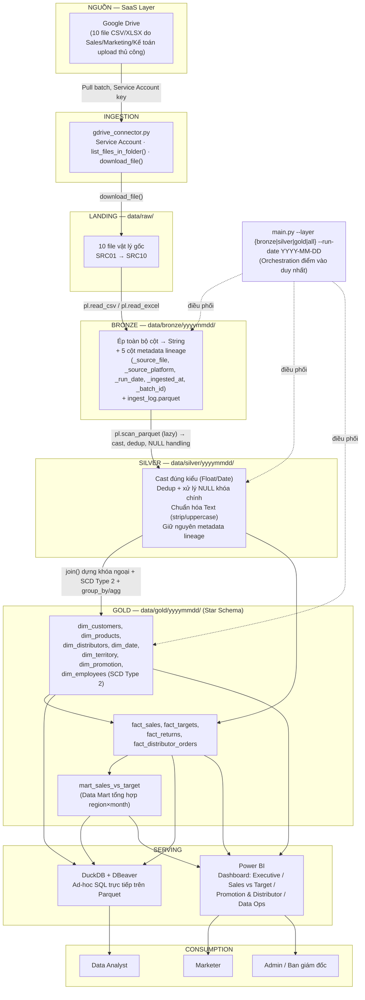

# VietDist Analytics Platform — Solution Architecture Blueprint

**Loại tài liệu:** Technical Design Document (TDD) — Kiến trúc kỹ thuật toàn diện
**Vai trò biên soạn:** Senior Solution Architect / Principal Data Engineer (mô phỏng, phản biện kỹ thuật)
**Phạm vi:** Bronze → Silver → Gold Lakehouse cho VietDist (nhà phân phối FMCG)
**Trạng thái:** v1.0 — dùng để bàn giao cho đội Data Engineer bắt đầu code (tham chiếu chi tiết acceptance criteria tại `phase1_bronze_ingestion.md`, `phase2_silver_cleansing.md`, `phase3_gold_production.md`, và use-case/BRD tại `docs/BRD_Solution_Architecture.md`)
**Ngày:** 2026-07-27

---

## BƯỚC 1 — Tóm tắt Đầu vào / Đầu ra

### Bối cảnh & Bài toán

VietDist là nhà phân phối FMCG, vận hành qua mạng lưới distributor và sales rep trải khắp các vùng miền. Toàn bộ dữ liệu Sales/Marketing/Kế toán hiện rải rác trên 10 file Excel/CSV, do từng phòng ban tự thu thập và upload thủ công lên một thư mục Google Drive dùng chung — không có **single source of truth**. Mỗi khi cần dựng báo cáo, đội ngũ phải tự mở nhiều file, dùng VLOOKUP để ghép nối thủ công — tốn nhiều giờ mỗi tuần, và khi số liệu sai lệch, không có cách nào truy vết xem lỗi bắt nguồn từ đâu.

### Bốn nỗi đau cốt lõi cần giải quyết

1. **Dữ liệu phân mảnh** — 10 nguồn (Sales, Marketing, Kế toán) dùng định dạng, quy ước đặt tên cột và cách ghi giá trị khác nhau (ví dụ: số tiền có dấu phẩy ngăn cách nghìn ở nguồn này, không có ở nguồn khác; mã khách hàng viết hoa/thường không nhất quán). Chưa có bước chuẩn hoá chung, nên không thể ghép nối trực tiếp giữa các nguồn mà không xử lý tay trước.
2. **Không tách bạch raw / clean / reporting** — dữ liệu thô, dữ liệu đã làm sạch, và báo cáo cuối cùng hiện đang trộn lẫn trong cùng các file Excel, không có ranh giới rõ ràng giữa 3 giai đoạn. Hậu quả: chỉ cần 1 lỗi nhỏ ở nguồn (ví dụ 1 dòng dữ liệu bị nhập sai), toàn bộ chuỗi VLOOKUP và báo cáo tay phía sau phải làm lại từ đầu, vì không có lớp trung gian nào để sửa và chạy lại riêng lẻ.
3. **Không có lineage** — không có cơ chế nào ghi lại một con số trong báo cáo bắt nguồn từ file nào, được xử lý qua bước nào, vào lúc nào. Khi phát hiện số liệu sai (ví dụ doanh số một vùng bị lệch), không có cách nào audit ngược lại để xác định lỗi nằm ở dữ liệu gốc hay ở bước tổng hợp thủ công.
4. **Thiếu đo lường tự động** — không có quy trình tự động để (a) đo ROI của từng chương trình khuyến mãi (chi phí bỏ ra so với doanh số phát sinh thêm), và (b) so sánh doanh số thực tế với target đã đề ra theo từng vùng và từng tháng. Mọi phép so sánh này hiện phải dựng tay, không cập nhật real-time và dễ sai sót khi làm lại nhiều lần.

### Đầu ra mong đợi

Một **Data Lakehouse tự động hoá hoàn toàn** theo kiến trúc Medallion (Bronze/Silver/Gold), sản xuất ra một **Star Schema duy nhất** — idempotent, có lineage đầy đủ — chạy qua **một lệnh CLI duy nhất**, phục vụ trực tiếp:

- **DuckDB** — ad-hoc SQL
- **Power BI** — dashboard tự phục vụ

Không cần đội DE can thiệp thủ công cho từng báo cáo.

Với quy mô hiện tại — 4 phòng ban dùng chung (Sales, Marketing, Kế toán, Ban giám đốc), chưa có hệ thống lưu trữ dữ liệu cũ nào cần giữ lại, cần triển khai nhanh với ngân sách hạn chế — đề xuất kiến trúc **Data Lakehouse**: một hệ thống duy nhất, xử lý dữ liệu thô → sạch → báo cáo trong cùng một chỗ, không cần đầu tư hai hệ thống tách biệt (Data Lake riêng + Data Warehouse riêng).

Khi công ty phát triển tới mức có team Data Science riêng với nhu cầu dữ liệu phi cấu trúc, hoặc cần sáp nhập với một hệ thống Data Warehouse có sẵn, lúc đó nên xem xét tách lại thành hai hệ thống riêng biệt. Nhưng tách sớm ở thời điểm hiện tại sẽ tốn thêm chi phí hạ tầng và thời gian triển khai mà chưa mang lại lợi ích tương xứng.

### Kết luận về lựa chọn công nghệ/hạ tầng

Với quy mô thực tế của bài toán — chỉ 10 file Excel/CSV, vài trăm nghìn dòng, do 1 người vận hành — việc đầu tư các nền tảng Lakehouse cấp doanh nghiệp như Databricks (cluster Spark, Unity Catalog, hạ tầng cloud AWS/Azure/GCP) là **không hợp lý về chi phí lẫn độ phức tạp** so với lợi ích mang lại. Thay vào đó, dự án áp dụng đúng **nguyên lý kiến trúc Lakehouse** — mô hình Medallion (Bronze/Silver/Gold) — nhưng triển khai bằng một stack nhẹ, chạy hoàn toàn trên máy cá nhân: **Polars** thay Spark, **Parquet** làm định dạng lưu trữ dùng chung cho cả 3 lớp, và một **CLI Python tự viết** làm điểm điều phối duy nhất.

Cách tiếp cận này giữ nguyên toàn bộ giá trị cốt lõi của kiến trúc Lakehouse — tách bạch raw/clean/reporting, có lineage đầy đủ, idempotent — mà không phải trả chi phí vận hành cho hạ tầng vượt quá nhu cầu thực tế. Khi volume dữ liệu hoặc số lượng người dùng tăng lên đáng kể trong tương lai, kiến trúc này có thể chuyển đổi sang nền tảng cloud mà không cần thay đổi tư duy thiết kế gốc.

### Kết luận Bước 1

Bước này xác lập 2 thứ trước khi động vào bất kỳ công nghệ nào: bài toán thật là gì (4 nỗi đau — phân mảnh, không tách raw/clean/report, mất lineage, thiếu đo lường tự động) và đầu ra phải nhìn thấy được (Lakehouse Medallion Bronze/Silver/Gold, ra Star Schema duy nhất, phục vụ qua DuckDB + Power BI). Ý nghĩa cuối cùng: mọi quyết định kỹ thuật ở Bước 2-5 phía sau chỉ có giá trị nếu giải quyết đúng 4 nỗi đau này — không phải chọn công nghệ theo xu hướng rồi đi tìm lý do biện minh ngược.

---

## BƯỚC 2 — Source Analysis (Phân tích nguồn dữ liệu)

### 2.1 Source Inventory

Toàn bộ 10 nguồn hiện tại đến từ **một điểm vào duy nhất**: thư mục dùng chung trên Google Drive, do con người upload thủ công. Đây là điểm quan trọng nhất chi phối toàn bộ thiết kế phía sau — không có OLTP database, không có webhook, không có event stream.

| Nguồn | Loại hệ thống | Phương thức trích xuất | Tần suất | Xử lý ban đầu sau khi nạp |
|---|---|---|---|---|
| SRC01 `sales_transactions.csv` | File-based (SaaS Drive) | Pull qua Google Drive API (Service Account) → batch download | Hàng ngày | Landing thô vào `data/raw/`, ép String, gắn metadata → Bronze |
| SRC02 `sales_target_plan.xlsx` | File-based, có versioning nội bộ (`plan_version`, `effective_from/to`) | Pull Drive API | Hàng tháng | Bronze giữ nguyên version-history, không merge sớm |
| SRC03 `customer_master.csv` | File-based, dạng "master" full-snapshot | Pull Drive API | Khi có KH mới/đổi | Bronze giữ mọi bản upload; khử trùng lặp xử lý ở Silver |
| SRC04 `product_master.xlsx` | File-based master | Pull Drive API | Khi ra mắt/ngưng SP | Bronze |
| SRC05 `distributor_orders.xlsx` | File-based transaction | Pull Drive API | Hàng ngày | Bronze |
| SRC06 `distributor_master.csv` | File-based master | Pull Drive API | Khi có NPP mới | Bronze |
| SRC07 `employee_master.xlsx` | File-based, **loại slowly-changing** (`version`, `effective_date`) | Pull Drive API | Khi thay đổi vị trí/vùng | Bronze giữ đủ history → Gold dựng SCD Type 2 |
| SRC08 `territory_mapping.xlsx` | File-based bridge/mapping theo kỳ hiệu lực | Pull Drive API | Khi đổi phân vùng | Bronze |
| SRC09 `return_transactions.csv` | File-based transaction | Pull Drive API | Hàng ngày | Bronze |
| SRC10 `promotion_program.xlsx` | File-based master theo chương trình | Pull Drive API | Khi mở/đóng chương trình | Bronze |

**Quyết định hiện tại:** Cả 10 nguồn dữ liệu đang dùng chung một cơ chế nạp dữ liệu (file tĩnh qua Google Drive), nên thay vì xây 10 pipeline/connector riêng biệt, hệ thống dùng **một connector duy nhất** (`gdrive_connector.py`), chạy lặp lại cho cả 10 nguồn thông qua tham số hoá. Cách làm này giúp giảm trùng lặp code, dễ bảo trì, và hạn chế nợ kỹ thuật ngay từ giai đoạn đầu (Bronze) của pipeline.

**Định hướng mở rộng:** Khi công ty phát triển thêm các nguồn dữ liệu mới có bản chất kỹ thuật khác (ví dụ: ERP/OLTP theo thời gian thực, POS của nhà phân phối, hoặc CRM dạng SaaS), hệ thống **sẽ cần xây thêm connector riêng** phù hợp với từng loại nguồn (CDC, REST API...), không tái sử dụng connector Google Drive hiện tại — vì bản chất kỹ thuật của các nguồn này khác biệt hoàn toàn.

**Điểm đảm bảo khả năng mở rộng:** Kiến trúc đã được thiết kế để các nguồn mới trong tương lai chỉ cần tuân theo đúng một "hợp đồng" dữ liệu chung ở lớp Bronze (5 trường metadata: nguồn gốc, nền tảng, ngày chạy, thời điểm nạp, mã lô dữ liệu). Nhờ vậy, việc bổ sung nguồn dữ liệu mới sau này sẽ không làm ảnh hưởng hay phải sửa lại các lớp xử lý phía sau (Silver, Gold) đã xây dựng.

**Tóm lại:** Với phạm vi hiện tại, một connector chung là lựa chọn tối ưu, tránh xây dựng dư thừa. Đồng thời, kiến trúc đã tính toán trước cho việc mở rộng nguồn dữ liệu trong tương lai mà không cần thiết kế lại từ đầu.

### 2.2 Data Characteristics & Quality

| Trục | Đánh giá | Hệ quả thiết kế |
|---|---|---|
| **Schema stability** | THẤP. File Excel/CSV do người upload tay — rủi ro đổi tên cột, thêm sheet, merge cell, đổi thứ tự cột giữa các lần upload | Bronze phải ép **toàn bộ về String** (schema-on-write tối giản) để không sập pipeline vì lỗi kiểu; validate kiểu chỉ thực hiện ở Silver nơi có thể xử lý lỗi có kiểm soát |
| **Volume** | THẤP–TRUNG BÌNH (quy mô SME, 10 file/ngày, ước tính hàng nghìn–hàng chục nghìn dòng/file). Không phải Big Data | Không cần compute phân tán (Spark/cluster). Single-node columnar engine (Polars + Parquet) là đủ và tối ưu chi phí |
| **Velocity** | Batch, tần suất ngày/tháng — KHÔNG có yêu cầu real-time | Loại bỏ hoàn toàn nhu cầu streaming (Kafka/Kinesis) khỏi phạm vi thiết kế |
| **Định dạng** | Structured (CSV) và bán-cấu-trúc (XLSX nhiều sheet, merge cell, định dạng số theo locale VN) | Cần engine đọc Excel chịu lỗi tốt (Polars + `fastexcel`); không thể coi XLSX tương đương CSV |
| **Rủi ro DQ điển hình** | (1) Trùng lặp `customer_master` do upload lại file cũ (xác nhận thực tế); (2) NULL `tax_code` ở `employee_master`; (3) số tiền dạng string có dấu phân cách nghìn (`1,000,000`) gây lỗi cast thẳng; (4) lệch múi giờ ở cột ngày; (5) khóa ngoại mồ côi khi nhân viên đổi vùng nhưng fact vẫn tham chiếu vùng cũ; (6) không có cơ chế phát hiện DELETE/UPDATE ở nguồn (full-file reload, không CDC) | Silver bắt buộc: dedup theo full-row, xử lý NULL khóa chính, `str.replace_all(",", "")` trước khi cast Float, chuẩn hóa Date/Timezone. Gold bắt buộc: SCD Type 2 cho `dim_employees` để tránh sai lệch lịch sử khi join theo `order_date` |

### Kết luận

Bảng "Đặc tính & Chất lượng dữ liệu" cho thấy VietDist ở giai đoạn hiện tại có **quy mô nhỏ, tần suất chậm, nhưng độ tin cậy dữ liệu đầu vào thấp** — schema không ổn định (file người dùng tự upload tay), có nhiều rủi ro chất lượng dữ liệu điển hình (trùng lặp, NULL khoá chính, sai định dạng số, khoá ngoại mồ côi). Đây là lý do kiến trúc chọn stack nhẹ (Polars + Parquet, chạy local), đồng thời đầu tư kỹ ở lớp Bronze (ép String, giữ lineage) và lớp Silver (dedup, validate, chuẩn hoá) để bù đắp cho độ tin cậy thấp của nguồn — thay vì đặt cược vào một hạ tầng lớn nhưng vẫn phải xử lý cùng những vấn đề chất lượng dữ liệu đó ở tầng dưới.

Nói cách khác: **vấn đề gốc của VietDist hiện tại không nằm ở hạ tầng (compute/volume), mà nằm ở quy trình thu thập dữ liệu thủ công** — nên đầu tư đúng trọng tâm là dedup và validate ở Silver, không phải đầu tư vào tính toán phân tán.

### Định hướng khi scale up

Khi VietDist phát triển lớn hơn, các chỉ số trong bảng này sẽ dịch chuyển theo hướng khác, và kiến trúc cần điều chỉnh tương ứng:

| Trục | Tín hiệu cho thấy cần scale | Hướng điều chỉnh |
|---|---|---|
| **Schema stability** | Nguồn dữ liệu chuyển từ file tay sang hệ thống tự động (ERP/CRM) | Có thể nới lỏng bớt việc ép String toàn bộ ở Bronze, vì schema nguồn đã đáng tin cậy hơn |
| **Volume** | Số dòng/file tăng vượt khả năng xử lý của 1 máy (hàng triệu dòng trở lên) | Cân nhắc chuyển từ Polars single-node sang compute phân tán (Spark/Databricks) |
| **Velocity** | Phát sinh yêu cầu xem dữ liệu gần thời gian thực (đơn hàng, tồn kho) | Bổ sung thêm nhánh xử lý streaming (Kafka/Kinesis) song song với batch hiện tại, không thay thế hoàn toàn |
| **Định dạng** | Xuất hiện nguồn dữ liệu mới qua API/CDC thay vì file tĩnh | Xây connector mới riêng biệt (đã nêu ở phần định hướng mở rộng nguồn), không tái sử dụng logic đọc Excel/CSV hiện tại |
| **Rủi ro DQ** | Số lượng nguồn tăng, mỗi nguồn có thể do hệ thống khác nhau ghi vào cùng 1 domain | Khi đó mới cần cân nhắc đầu tư nền tảng Master Data Management (MDM) chuyên dụng, thay vì dedup đơn giản như hiện tại |

**Nguyên tắc chung khi scale:** không thay đổi toàn bộ kiến trúc ngay khi có 1 tín hiệu đơn lẻ — chỉ điều chỉnh đúng phần bị ảnh hưởng, dựa trên bằng chứng đo lường thực tế (số dòng, tần suất, loại nguồn mới), tương tự cách bảng này

### 2.3 Bảng Checkpoint — Tổng hợp yếu tố quyết định kiến trúc

| Tiêu chí | Giá trị (VDAP) | Ảnh hưởng đến quyết định | Vì sao không chọn công nghệ "chuẩn Enterprise" |
|---|---|---|---|
| **Business Size** | SME | Không cần hạ tầng cấp Enterprise | Hạ tầng Enterprise (multi-cluster, HA, DR đa vùng...) được thiết kế cho hàng trăm/nghìn nhân sự vận hành song song — chi phí quản lý và vận hành vượt xa nhu cầu của 1 doanh nghiệp SME, trong khi lợi ích (uptime 99.99%, khả năng chịu lỗi cực cao) không cấp thiết ở quy mô này. |
| **Users** | Chưa có con số chính thức — 3 nhóm actor (Marketer, DA, Admin), quy mô nội bộ vài người/nhóm | Không cần multi-tenant/RBAC production | Multi-tenant/RBAC (phân quyền chi tiết theo vai trò, cách ly dữ liệu giữa nhiều khách hàng/tổ chức) giải quyết bài toán "nhiều tổ chức dùng chung 1 hệ thống, không được thấy dữ liệu của nhau" — VDAP chỉ có 1 tổ chức, vài người dùng nội bộ, không có nhu cầu cách ly đó. |
| **Data Volume** | MB–GB | Loại compute phân tán (Spark) khỏi phạm vi, dùng engine single-node | Spark được thiết kế để chia dữ liệu ra nhiều máy xử lý song song khi dữ liệu vượt quá RAM của 1 máy. Với vài trăm nghìn dòng (MB–GB), dữ liệu vừa hoàn toàn trong RAM 1 máy — dùng Spark chỉ tốn thêm chi phí khởi động cluster mà không tận dụng được khả năng phân tán. |
| **Data Velocity** | Batch | Loại Kafka/streaming khỏi phạm vi | Kafka/streaming giải quyết bài toán dữ liệu cần xử lý ngay khi phát sinh (độ trễ giây/mili-giây). VDAP không có yêu cầu này — dữ liệu cập nhật theo ngày/tháng, nên hệ thống hàng đợi thời gian thực chỉ thêm độ phức tạp vận hành mà không mang lại giá trị tương xứng. |
| **Data Freshness** | Daily (giao dịch chính) / theo sự kiện (master data) | SLA phút-giờ là đủ, không cần real-time | Đầu tư hạ tầng đạt SLA giây/mili-giây (streaming pipeline, in-memory processing) chỉ hợp lý khi nghiệp vụ thực sự cần thấy số liệu tức thời — báo cáo doanh số/target theo vùng không đòi hỏi độ mới ở mức đó, nên SLA phút-giờ qua batch xử lý là đủ. |
| **Data Quality** | Trung bình–thấp (schema không ổn định, có duplicate/NULL đã biết) | Bronze phải fail-safe (ép String); Silver phải chủ động dedup/xử lý NULL | Các công cụ quản trị dữ liệu chuyên sâu (Data Quality platform, Great Expectations ở quy mô enterprise) phù hợp khi có hàng chục nguồn với đội ngũ chuyên trách theo dõi liên tục. Ở đây, các bước dedup/validate tự viết trong Silver đã đủ xử lý các lỗi đã biết rõ nguyên nhân. |
| **Compliance** | Nghị định 13/2023 (VN PDPD) — không GDPR/HIPAA/PCI-DSS | `.gitignore` + `.env` là đủ, không cần KMS/IAM enterprise | KMS (Key Management Service) và IAM enterprise được yêu cầu bởi các chuẩn nghiêm ngặt như GDPR/HIPAA/PCI-DSS (mã hoá tại chỗ, audit trail chi tiết, luân chuyển khoá tự động). VDAP chỉ cần tuân thủ Nghị định 13/2023, yêu cầu thấp hơn nhiều — quản lý secret qua `.env`/`.gitignore` là đủ đáp ứng. |
| **Budget** | Thấp (OpEx≈0, CapEx≈0) | Loại Cloud-native đầy đủ khỏi phạm vi hiện tại | Hạ tầng cloud-native đầy đủ (managed Kubernetes, managed Spark, Data Warehouse cloud...) phát sinh chi phí vận hành hàng tháng cố định, không phù hợp ngân sách gần như bằng 0 của giai đoạn hiện tại — stack chạy local không phát sinh chi phí hạ tầng. |
| **Team Skill** | Python + SQL — chưa có Spark/DevOps/Cloud Ops | Loại Spark/Airflow/Terraform khỏi Stage 1 | Dùng công nghệ vượt quá kỹ năng hiện có (Spark, Airflow, Terraform) sẽ tốn thời gian học thêm không cần thiết cho giai đoạn 1, làm chậm tiến độ triển khai mà chưa mang lại giá trị tương xứng so với việc dùng đúng công cụ khớp kỹ năng đang có (Python/SQL). |
| **Growth Projection** | Chưa có mốc thời gian chính thức từ BRD | Roadmap thiết kế theo **trigger-based**, không theo mốc năm cố định | Đầu tư trước cho quy mô tương lai (over-engineering) khi chưa có mốc tăng trưởng cụ thể là lãng phí — thiết kế theo trigger đo lường được (vượt ngưỡng RAM, số lượng nguồn tăng, yêu cầu real-time phát sinh) đảm bảo chỉ nâng cấp đúng lúc cần, không phải đoán trước một cách chủ quan. |

### 2.4 Core Dimensions & Metrics (bắt buộc cho báo cáo lãnh đạo)

**Dimensions bắt buộc:** `dim_date`, `dim_customers`, `dim_products`, `dim_distributors`, `dim_territory`, `dim_promotion`, và `dim_employees` (SCD Type 2 — bắt buộc vì bài toán "doanh số theo đúng nhân viên/vùng tại thời điểm phát sinh đơn hàng" không giải được bằng snapshot hiện tại).

**Metrics bắt buộc** (ánh xạ trực tiếp từ yêu cầu Ban giám đốc/Marketer trong BRD mục 4.2):

| Nhóm | Metric | Vì sao bắt buộc |
|---|---|---|
| Doanh số | Revenue thực tế, Growth MoM/YoY | Câu hỏi nền tảng nhất của mọi báo cáo điều hành |
| Target | Achievement rate, Variance theo vùng/tháng | Chính là yêu cầu gốc của dự án ("Doanh số thực tế so với Target theo từng vùng") |
| Khuyến mãi | Promotion Uplift, Promotion ROI | Giải quyết pain point "không đo được ROI khuyến mãi" |
| Distributor | Fill Rate, On-time Delivery % | Đo hiệu suất chuỗi cung ứng, không thể suy ra nếu không có `fact_distributor_orders` |
| Khách hàng | Return Rate | Cảnh báo chất lượng sản phẩm/vận hành |
| Nhân sự | Doanh số/nhân viên theo đúng vùng lịch sử | Chỉ tính đúng được nếu có SCD Type 2 |
| Vận hành | Pipeline Success Rate | Bắt buộc với vai trò Admin — không có observability thì không vận hành được production |

### 2.5 Data Modeling Strategy

#### 2.5.1 Quyết định: Star Schema cho Gold layer

| Phương án | Phù hợp? | Lý do |
|---|---|---|
| **3NF (Normalized)** | Không | Tối ưu cho ghi giao dịch (OLTP), không phải đọc phân tích. VDAP không có write pattern OLTP — Gold chỉ phục vụ query BI |
| **Data Vault** | Không, hiện tại | Vault mạnh khi tích hợp **nhiều hệ thống nguồn không đồng nhất** với lịch sử insert-only phức tạp (Hub/Link/Satellite). VDAP có đúng 1 connector, 10 file cùng 1 platform — độ phức tạp tích hợp không đủ lớn để hoàn vốn chi phí thiết kế/vận hành Vault |
| **Wide/Denormalized single table** | Không | Mất khả năng tái sử dụng dimension (vd `dim_employees` SCD2 cần join lại nhiều fact khác nhau); khó quản lý grain riêng của `fact_sales` vs `fact_distributor_orders` |
| **Star Schema** | **Chọn** | Đúng chuẩn phục vụ BI/self-service (Power BI, DuckDB ad-hoc); dimension tái sử dụng được giữa nhiều fact; độ phức tạp vừa đủ với đội 1 người |

#### 2.5.2 Áp dụng theo loại nguồn (nguyên tắc tổng quát cho lần thiết kế sau)

| Loại nguồn | Model phù hợp | Áp dụng ở VDAP |
|---|---|---|
| MarTech/BI-facing | Star Schema | `dim_promotion`, `fact_sales` |
| ERP-like (nếu có sau này) | 3NF trước khi vào Gold | Chưa có ERP thật ở VDAP |
| Multi-source raw integration | Data Vault | Không áp dụng — chỉ 1 nguồn |

#### 2.5.3 Star Schema thực tế (giữ nguyên từ BRD 2.4, đã đúng)

```text
                         dim_date
                            │
      dim_customers ───┐    │    ┌─── dim_products
                        │   │    │
                    fact_sales (grain: 1 dòng/order line)
                        │   │    │
      dim_employees ────┘   │    └─── dim_territory
        (SCD Type 2)        │
                            │
                     fact_targets ──── dim_employees, dim_date
                     fact_returns ──── dim_customers, dim_products, dim_employees
              fact_distributor_orders ── dim_distributors, dim_products
                     dim_promotion ──── fact_sales (join theo product + khoảng ngày)

                     mart_sales_vs_target (Data Mart tổng hợp theo region + month)
```

`dim_employees` (SCD Type 2): `employee_key, employee_id, name, region, team, valid_from, valid_to, is_current`.

### Kết luận Bước 2

Phân tích nguồn cho thấy: cả 10 nguồn cùng vào từ 1 điểm (Google Drive, người tự upload) — không CDC, schema không ổn định, volume nhỏ (MB-GB), tần suất batch. Đây là lý do dùng 1 connector chung thay vì 10, Bronze phải ép String toàn bộ, và Star Schema (không phải 3NF/Vault/Wide table) được chọn cho Gold vì đúng chuẩn phục vụ BI với độ phức tạp vừa đội 1 người. Ý nghĩa cuối cùng: đặc tính nguồn (không phải sở thích công nghệ) là thứ quyết định toàn bộ ràng buộc kỹ thuật ở các bước sau.

---

## BƯỚC 3 — Quyết định ETL vs ELT

### 3.1 Hai hướng khả thi: ETL cổ điển vs ELT/Medallion Lakehouse

#### Hướng 1 — ETL cổ điển (Extract → Transform → Load)

```text
Google Drive → [Transform: cast/dedup/join/model NGAY khi đọc] → Load thẳng vào Data Warehouse (chỉ lưu bảng đã sạch/đã model)
```

Dữ liệu được xử lý (làm sạch, ghép nối, dựng model) **ngay trong lúc đọc**, và chỉ bảng kết quả cuối cùng mới được lưu lại vào kho.

**Vấn đề:** Dữ liệu thô **không được lưu lại**. Nếu sau này phát hiện logic transform có lỗi, hoặc cần thay đổi cách xử lý, bắt buộc phải quay lại nguồn gốc (Google Drive) để chạy lại từ đầu — nhưng Google Drive **không giữ lịch sử phiên bản đáng tin cậy** (file có thể đã bị ghi đè, xoá, hoặc thay đổi mà không ai biết bản gốc lúc đó trông ra sao).

#### Hướng 2 — ELT / Medallion Lakehouse (Extract → Load raw → Transform nhiều bước)

```text
Google Drive → Load nguyên trạng (Bronze, String) → Transform lần 1: clean/cast/dedup (Silver) → Transform lần 2: model hóa Star Schema (Gold)
```

Dữ liệu được **tải nguyên bản vào kho trước** (Bronze, giữ nguyên toàn bộ dưới dạng String), sau đó mới xử lý qua nhiều bước riêng biệt.

**Lợi ích:** Dữ liệu thô **luôn được lưu bền vững ở Bronze** — độc lập với Google Drive. Nếu phát hiện lỗi ở bất kỳ bước transform nào (Silver hoặc Gold), có thể **replay lại** (chạy lại) trực tiếp từ Bronze, mà không cần phụ thuộc vào việc file gốc trên Drive còn tồn tại hay còn giữ đúng nội dung ban đầu hay không.

#### So sánh nhanh

| | ETL cổ điển | ELT / Medallion Lakehouse |
|---|---|---|
| Dữ liệu thô có được lưu lại không | Không | Có (ở Bronze) |
| Khi transform sai, sửa lại thế nào | Phải quay về nguồn gốc (Drive) — rủi ro vì Drive không giữ version lịch sử đáng tin cậy | Replay trực tiếp từ Bronze, không phụ thuộc nguồn gốc bên ngoài |
| Khả năng audit khi có lỗi | Hạn chế — không có bản gốc để đối chiếu | Đầy đủ — luôn có Bronze làm căn cứ so sánh |

### 3.2 Lựa chọn: **ELT (Medallion, Load-first)**

Lý do quyết định, không mơ hồ:

1. **Nguồn dữ liệu không đáng tin cậy về schema/chất lượng** (file người dùng tự upload). ETL cổ điển transform-in-flight nghĩa là nếu logic transform sai một lần, dữ liệu raw đã mất — không có cách nào audit lại "số liệu gốc trước khi transform là gì". Với dạng nguồn rủi ro cao thế này, giữ raw là bắt buộc, không phải tùy chọn.
2. **Yêu cầu lineage/audit là yêu cầu cứng của BRD** (US-02, US-08, UC-09) — chỉ ELT với lớp Bronze bất biến mới trả lời được câu hỏi "batch nào, file nào, lúc nào" mà không cần hệ thống log ngoài.
3. **Idempotency** (yêu cầu xuyên suốt cả 3 phase) tự nhiên hơn nhiều trong mô hình ELT theo partition ngày — chạy lại chỉ ghi đè đúng thư mục `yyyymmdd`, không phụ thuộc trạng thái transform phức tạp.
4. Compute rẻ (Polars single-node, Parquet columnar) khiến việc "Load rồi Transform nhiều lần" gần như không tốn thêm chi phí đáng kể so với transform một lần — lợi ích governance vượt xa chi phí biên.

### 3.3 Trade-off chi tiết

| Tiêu chí | ETL cổ điển | ELT/Medallion (đã chọn) |
|---|---|---|
| **Latency** | Nhanh hơn về lý thuyết (ít bước ghi) nhưng vô nghĩa ở đây vì cả hệ thống chạy batch ngày, không có SLA phút/giây | Có thêm 2 bước ghi (Bronze, Silver) trước Gold — độ trễ cộng thêm là vài giây–phút cho volume MB-GB hiện tại, chấp nhận được hoàn toàn |
| **Chi phí hạ tầng/vận hành** | Thấp hơn nếu tính storage (không lưu raw) NHƯNG rủi ro vận hành cao hơn (không debug được khi sai) | Storage tăng nhẹ (raw String Parquet vẫn nén tốt, không phải CSV thô) — chi phí gần như 0 vì chạy local/Parquet nén, đổi lại giảm hẳn chi phí incident-response |
| **Team skillset** | Đòi hỏi viết transform logic "đúng ngay từ lần đầu" vì không có lưới an toàn raw layer — rủi ro cao với đội 1 fresher DE | Cho phép sai và sửa lại Silver/Gold nhiều lần mà không lo mất dữ liệu gốc — phù hợp năng lực đội hiện tại (đang học, sẽ có bug) |
| **Tận dụng Lakehouse hiện đại** | Không tận dụng được thế mạnh cột (columnar) của Parquet cho nhiều lớp — chỉ có 1 lớp thành phẩm | Đúng tinh thần Lakehouse: DuckDB/Power BI có thể query cả Silver lẫn Gold khi cần debug số liệu, không chỉ Gold |

**Kết luận:** ELT theo kiến trúc Medallion 3 lớp là lựa chọn đúng cho quy mô, độ tin cậy nguồn, và năng lực đội hiện tại — không phải vì "xu hướng hiện đại" mà vì nó trực tiếp giải quyết pain point lineage/idempotency nêu trong BRD.

**Lưu ý về công cụ thực thi:** đây là ELT về mặt *triết lý kiến trúc* (Load raw trước, Transform nhiều lần sau, mỗi lớp được materialize), nhưng công cụ transform là **Polars (compute engine Python)**, không phải SQL chạy trong một Data Warehouse như dbt thường làm. Lý do và trade-off của quyết định này nằm ở Bước 5.

### Kết luận Bước 3

Đã chọn ELT/Medallion (Load raw trước, Transform nhiều lần sau) thay vì ETL cổ điển, vì nguồn không đáng tin cậy về schema/chất lượng và BRD yêu cầu lineage/audit là bắt buộc, không phải tùy chọn. Ý nghĩa cuối cùng: lớp Bronze bất biến là xương sống của toàn kiến trúc — mọi lỗi transform ở Silver/Gold đều sửa và chạy lại được mà không mất dữ liệu gốc, đánh đổi lại là thêm vài giây-phút xử lý, chấp nhận được ở quy mô này.

---

## BƯỚC 4 — Quyết định Mô hình Hạ tầng

| Loại | Ví dụ | Quyết định | Vì sao |
|---|---|---|---|
| **Object Storage** | S3/GCS/Blob | Không dùng — chạy local | Object Storage giải quyết bài toán lưu trữ dữ liệu ở quy mô lớn, truy cập từ nhiều nơi/nhiều dịch vụ cloud khác nhau, và tính phí theo dung lượng thực tế. Với volume MB-GB và chỉ 1 máy vận hành, ổ cứng local đã đủ chứa, không cần trả phí lưu trữ cloud cho nhu cầu chưa phát sinh. |
| **Lakehouse table format** | Delta/Iceberg/Hudi | **Không dùng, có chủ đích** | 3 định dạng này giải quyết bài toán nhiều tiến trình cùng ghi đồng thời vào cùng 1 bảng (multi-writer), cần đảm bảo toàn vẹn giao dịch (ACID) và xem lại phiên bản cũ (time travel). VDAP chỉ có 1 người, 1 tiến trình ghi tuần tự — không có rủi ro xung đột khi ghi, nên không cần lớp quản lý transaction phức tạp này. Thêm vào sẽ tốn công vận hành (cần engine riêng, quản lý checkpoint) mà không giải quyết vấn đề nào đang tồn tại. |
| **File format** | Parquet | **Chọn** | Parquet là định dạng lưu trữ dạng cột (columnar), nén tốt, đọc nhanh khi cần quét và tổng hợp số liệu lớn (đúng nhu cầu OLAP của các lớp Bronze/Silver/Gold). Đây là lựa chọn tiêu chuẩn trong hệ sinh thái Data Engineering hiện đại, được cả Polars và DuckDB hỗ trợ đọc/ghi trực tiếp mà không cần chuyển đổi thêm. |
| **Warehouse** | BigQuery/Snowflake/Redshift | Không dùng | Các nền tảng này là dịch vụ Data Warehouse quản lý trên cloud, tính phí theo compute/storage sử dụng — phù hợp khi cần phục vụ nhiều người dùng truy vấn đồng thời ở quy mô lớn. Với khối lượng truy vấn hiện tại (vài người dùng nội bộ, dữ liệu MB-GB), chi phí vận hành các nền tảng này vượt xa giá trị thu lại, trong khi DuckDB đã đáp ứng đủ nhu cầu truy vấn SQL ở quy mô này. |
| **Operational DB** | Postgres/MySQL/Mongo | Không cần | Các database này tối ưu cho khối lượng ghi/đọc giao dịch đơn lẻ, liên tục (OLTP) — ví dụ ghi nhận từng đơn hàng ngay khi phát sinh. Lớp Gold của VDAP chỉ phục vụ mục đích đọc (dashboard, ad-hoc SQL), không có nhu cầu ghi liên tục kiểu giao dịch, nên không cần vận hành thêm một database riêng cho việc này. |

### Kết luận

Trong 5 loại storage/table-format phổ biến của ngành Data Engineering, VDAP chỉ thực sự cần **2 thành phần đơn giản nhất**: **local filesystem** (nơi lưu file) và **Parquet thô** (định dạng file) — cả 3 loại còn lại (Object Storage, Lakehouse table format, Data Warehouse, Operational DB) đều bị loại **có lý do cụ thể**, không phải vì chưa biết tới hay bỏ sót.

Điểm chung của cả 3 lý do loại trừ: chúng đều được thiết kế để giải quyết những bài toán **VDAP hiện tại chưa gặp phải** — lưu trữ quy mô lớn cần truy cập từ nhiều nơi (Object Storage), nhiều tiến trình ghi đồng thời cần đảm bảo toàn vẹn giao dịch (Delta/Iceberg/Hudi), nhiều người dùng truy vấn đồng thời ở quy mô lớn (Data Warehouse), hoặc ghi nhận giao dịch liên tục thời gian thực (Operational DB). Ở quy mô 1 người vận hành, dữ liệu MB-GB, ghi tuần tự theo batch, việc đầu tư thêm các lớp công nghệ này chỉ tạo ra chi phí vận hành mà không giải quyết vấn đề nào đang thực sự tồn tại.

Quyết định dừng ở Parquet + local filesystem không phải vì giới hạn hiểu biết, mà là lựa chọn tối giản có chủ đích — đúng với nguyên tắc xuyên suốt của toàn bộ kiến trúc: chỉ thêm độ phức tạp khi có bằng chứng thực tế đòi hỏi, không đầu tư trước cho quy mô chưa xảy ra.

Nhược điểm cốt lõi của "Parquet thô + local filesystem" là thiếu hẳn lớp bảo vệ tự động (atomic write, schema evolution, multi-writer safety) mà Delta/Iceberg cung cấp sẵn — VDAP chấp nhận đánh đổi này vì đơn giản, rẻ, và đúng với thực tế hiện tại (1 người, ghi tuần tự), nhưng đây là "nợ kỹ thuật có điều kiện": nếu quy mô/số người vận hành tăng lên mà không nâng cấp kịp, các rủi ro trên sẽ từ "lý thuyết" trở thành "sự cố thật".

Nếu sau này VDAP phát triển thành: 3 pipeline con (1 cái tải Sales, 1 cái tải Marketing, 1 cái tải Kế toán) chạy song song, cùng ghi vào chung 1 bảng Gold — lúc đó bắt đầu có rủi ro 2 pipeline ghi đè lẫn nhau. Đây chính là lúc cần Delta/Iceberg để đảm bảo an toàn.

### 4.1 Phân tích các phương án

Đây là bước "loại trừ có căn cứ" — không chỉ chọn 1 phương án, mà chứng minh 2 phương án còn lại đều không hợp lý.

Nhớ lại bảng checkpoint bạn vừa xây (Business Size: SME, Budget: Thấp...) — bảng này chính là áp kết quả checkpoint đó vào 3 lựa chọn hạ tầng cụ thể, xem cái nào khớp.

#### Phương án 1 — Cloud-native đầy đủ

**Các lựa chọn cụ thể:** AWS S3+Glue+Athena, GCP GCS+BigQuery, Azure ADLS+Synapse

Giải thích từng cái là gì:
- **AWS S3+Glue+Athena:** S3 (lưu file), Glue (ETL tự động trên cloud), Athena (query SQL trên S3)
- **GCP GCS+BigQuery:** tương tự nhưng của Google, BigQuery là data warehouse cloud
- **Azure ADLS+Synapse:** tương tự nhưng của Microsoft

**Vì sao "KHÔNG phù hợp":** Đây chính là câu trả lời trực tiếp cho câu hỏi bạn hỏi mình trước đó ("sao không dùng Databricks") — áp dụng cho cả họ công nghệ cloud managed, không riêng Databricks. Nhớ lại bảng checkpoint: Budget: Thấp (OpEx≈0), Data Volume: MB-GB — dùng cloud managed service nghĩa là trả phí hàng tháng cho hạ tầng dù dữ liệu chỉ vài trăm nghìn dòng, không tương xứng.

#### Phương án 2 — On-Premises thuần

Toàn bộ chạy trên máy chủ/laptop nội bộ, không phụ thuộc SaaS nào.

**Vì sao "Không khả thi tuyệt đối"** — đây là điểm quan trọng nhất cần hiểu:

Chữ "tuyệt đối" ở đây rất đáng chú ý — khác hẳn phương án 1 (chỉ "không phù hợp", nghĩa là về lý thuyết vẫn làm được, chỉ là không hợp lý). Phương án 2 không làm được về mặt vật lý, vì lý do đơn giản:

> "Nguồn dữ liệu ĐANG nằm trên Google Drive (SaaS), không thể 'on-prem hóa' điểm vào"

Nghĩa là: bạn không kiểm soát được nơi Sales/Marketing/Kế toán đang upload file — họ đang dùng Google Drive (dịch vụ đám mây của Google), không phải máy chủ nội bộ công ty. Muốn "on-premises thuần" (không đụng gì tới cloud), bạn phải bắt cả công ty đổi cách làm việc (không dùng Google Drive nữa) — đây là thay đổi quy trình con người, không phải thay đổi kỹ thuật, và ngoài phạm vi quyết định kiến trúc của bạn.

**Ví dụ đời thường:** Giống việc bạn muốn "tự trồng rau 100% không mua ở chợ", nhưng nguồn nguyên liệu nấu ăn hàng ngày của cả gia đình đang mua từ chợ — bạn không thể ép cả gia đình ngừng đi chợ chỉ vì bạn muốn "tự cung tự cấp" tuyệt đối.

#### Phương án 3 — Hybrid thực dụng (được đề xuất)

- Nguồn (Google Drive) = SaaS
- Storage/Compute (Bronze/Silver/Gold, DuckDB) = Local/single-node

**Vì sao đây là lựa chọn hợp lý** — dung hoà cả 2 vấn đề trên:
- Không đòi hỏi đổi nguồn dữ liệu (chấp nhận Google Drive vẫn là SaaS, vì đó là thực tế đang có, không thể thay đổi ngay) → giải quyết được lý do khiến Phương án 2 bất khả thi
- Không cần trả phí cloud managed cho phần xử lý (Bronze/Silver/Gold chạy local bằng Polars, query bằng DuckDB — đều miễn phí, chạy trên máy cá nhân) → giải quyết được lý do khiến Phương án 1 không phù hợp

### 4.2 Lập luận bảo vệ lựa chọn: Hybrid thực dụng (SaaS-source, local-compute)

- **OpEx vs CapEx:** VietDist là SME, chưa có ngân sách hạ tầng cloud DW cố định và chưa có đội hạ tầng riêng. Chạy Bronze/Silver/Gold trên local filesystem + Parquet + DuckDB có OpEx gần bằng 0 (không trả phí compute/storage cloud theo giờ), trong khi CapEx cũng gần 0 (không cần mua server). Đây là điểm quyết định lớn nhất: **volume dữ liệu (MB–GB/ngày) không đủ lớn để cloud DW hoàn vốn chi phí vận hành** (network egress, cluster warm-up, license BI connector...).
- **Security & Compliance:** Dữ liệu chứa PII ở mức trung bình (`phone`, `address`, `tax_code` của khách hàng/NPP) — chịu điều chỉnh của Nghị định 13/2023/NĐ-CP về bảo vệ dữ liệu cá nhân tại Việt Nam, KHÔNG phải GDPR/HIPAA/PCI-DSS (không xử lý dữ liệu y tế, không xử lý thẻ thanh toán trực tiếp). Yêu cầu compliance thực tế chỉ ở mức: kiểm soát truy cập `credentials.json` (Service Account key), không public dữ liệu khách hàng ra ngoài. Điều này **không đòi hỏi** hạ tầng cloud enterprise-grade (KMS, VPC, IAM phức tạp) — kiểm soát bằng `.gitignore` + biến môi trường `.env` là đủ tương xứng với mức rủi ro hiện tại. Cloud-native đầy đủ ở giai đoạn này là **over-engineering bảo mật** so với rủi ro thực tế, tốn effort mà không tăng tương xứng giá trị.
- **Scalability/HA:** Đây là điểm yếu thật sự của phương án hiện tại — chạy single-node nghĩa là **không có High Availability**, không có DR, và bị giới hạn bởi RAM máy chạy (Polars là in-memory engine dù có lazy evaluation). Rủi ro này được **chấp nhận có ý thức** ở quy mô hiện tại (batch ngày, không SLA uptime), nhưng phải được nêu rõ ràng như một **giới hạn kiến trúc có điều kiện scale**, không phải điểm mù.
- **Vì sao loại các phương án còn lại:**
  - *On-Prem thuần* bị loại vì không tương thích vật lý với nguồn dữ liệu (Drive là SaaS, không thể ép về on-prem mà không thay đổi hành vi nghiệp vụ của phòng Sales/Marketing/Kế toán — chi phí thay đổi quy trình con người còn lớn hơn chi phí hạ tầng).
  - *Cloud-native đầy đủ* bị loại vì: (a) chi phí vận hành cloud DW (BigQuery/Snowflake/Redshift) tính theo compute/storage sẽ vượt xa giá trị mang lại ở volume MB-GB/ngày; (b) đội ngũ hiện tại (1 DE) chưa có năng lực vận hành IAM/network/cost-governance cloud một cách an toàn — triển khai vội sẽ tạo rủi ro misconfiguration (bucket public, over-provision) cao hơn lợi ích.

**Điều kiện kích hoạt (trigger) để chuyển sang Cloud-native:** khi xảy ra **một trong** các điều kiện sau — (1) volume vượt khả năng RAM single-node xử lý ổn định bằng Polars, (2) cần nhiều analyst truy vấn đồng thời (DuckDB single-node không có concurrency/RBAC thật sự), (3) yêu cầu SLA uptime/DR chính thức từ Ban giám đốc, (4) số lượng nguồn dữ liệu tăng vượt khả năng một connector/CLI đơn lẻ quản lý — lúc đó nâng cấp Gold layer lên BigQuery/Snowflake, orchestration lên Airflow managed (Cloud Composer/MWAA), giữ nguyên Bronze/Silver logic (Polars transform logic chuyển sang dbt tương đối trực tiếp vì đã có contract Star Schema rõ ràng).

### Kết luận Bước 4

Đã loại Cloud-native đầy đủ (chi phí không tương xứng volume MB-GB) và On-Prem thuần (không khả thi vì nguồn là SaaS), chọn Hybrid: nguồn ở Drive (SaaS), storage/compute chạy local (Parquet thô, không Delta/Iceberg). Ý nghĩa cuối cùng: hạ tầng hiện tại đúng cho quy mô 1 người vận hành/portfolio, nhưng có giới hạn thật (không HA/DR) — đây là đánh đổi có ý thức, không phải điểm mù, và đã có sẵn trigger rõ ràng để biết khi nào cần đổi.

---

## BƯỚC 5 — Tech Stack & Architecture (Thiết kế chi tiết)

### 5.1 Tech Stack theo từng lớp

| Lớp | Công nghệ chọn | Vai trò cụ thể |
|---|---|---|
| **Ingestion / Data Capture** | Google Drive API v3 + Service Account (`gdrive_connector.py`), Python `google-api-python-client` | List + pull file batch từ thư mục dùng chung; xác thực bằng key JSON, không OAuth interactive (phù hợp chạy tự động, không người ngồi login) |
| **Storage / Raw / Landing** | Local filesystem, `data/raw/` (file vật lý gốc) → `data/bronze/yyyymmdd/` (Parquet, String-only, partition theo ngày) | Landing zone bất biến, an toàn kiểu dữ liệu, idempotent theo partition |
| **Transformation / Data Modeling** | Polars (Lazy API: `scan_parquet` → `collect` chỉ ở bước cuối) + `fastexcel` (đọc XLSX chịu lỗi cho SRC02/04/05/07/08/10), thực thi qua `main.py` | Cast kiểu, dedup, xử lý NULL, join dựng Star Schema, SCD Type 2 bằng `shift()`/`over()` |
| **Data Lakehouse (Warehouse thay thế)** | Parquet (columnar, nén, giữ schema) làm storage format ở cả 3 lớp; **DuckDB** làm query engine ảo hóa warehouse trên Parquet | Không cần server DB — DuckDB embedded, chạy trực tiếp trên file, zero-ops |
| **Serving / BI / Analytics** | Power BI (kết nối trực tiếp Gold Parquet/DuckDB) cho Marketer/BGĐ; DBeaver + DuckDB SQL cho Data Analyst ad-hoc | Tách rõ 2 nhu cầu: dashboard cố định vs truy vấn tùy biến |
| **Orchestration** | CLI đơn nhất `main.py` (Python `argparse`, tham số `--layer {bronze,silver,gold,all}`, `--run-date`) | Orchestration tối giản, tuyến tính 3 bước, không cần scheduler engine riêng ở quy mô hiện tại |
| **Data Quality / Testing** | `pytest` (`test_pipeline.py`) — test logic Data Mart và logic SCD Type 2 | Kiểm chứng transform logic đúng trước khi merge, không phải "chạy ra số là xong" |
| **Observability** | `ingest_log.parquet` tự dựng (`batch_id, source_file, rows_loaded, status, duration_sec`) | Observability tối thiểu nhưng đủ trả lời "batch nào lỗi, đọc bao nhiêu dòng, mất bao lâu" |
| **Secrets Management** | `.env` (biến trỏ đường dẫn key) + `.gitignore` chặn `credentials.json` + Service Account cấp quyền **read-only, chỉ đúng 1 thư mục Drive** (không cấp quyền ghi/xoá toàn Drive) | Ngăn rò rỉ Service Account key ra Git/GitHub; giới hạn least-privilege để lộ key cũng không thể sửa/xoá dữ liệu nguồn, chi phí thêm gần như 0 vì chỉ là cấu hình đúng quyền lúc tạo Service Account |
| **Dependency Management** | `uv` + `pyproject.toml` | Môi trường reproducible, tách biệt dependency theo project |

### 5.2 Biện luận phản biện — vì sao KHÔNG chọn phương án khác

#### Polars vs Pandas vs Spark

Pandas: đơn luồng, bị giới hạn GIL, chậm hơn đáng kể ở thao tác join/group_by trên vài trăm nghìn–triệu dòng — không tận dụng được multi-core của máy hiện đại. Spark: overkill tuyệt đối — cần JVM, cluster (dù chạy local mode vẫn nặng), đường cong học tập cao, và đội 1 người không có nhu cầu lẫn năng lực vận hành Spark cluster cho khối lượng dữ liệu MB-GB. Polars: engine Rust đa luồng, Lazy API tối ưu query plan tự động, cú pháp gần SQL/Pandas nên dễ tiếp cận với dev Python, chạy tốt trên một máy — đúng "sweet spot" cho quy mô và năng lực đội hiện tại.

#### DuckDB vs BigQuery / Snowflake / Redshift

Ba lựa chọn cloud DW đều yêu cầu: tài khoản cloud, chi phí compute/storage theo giờ hoặc theo query, cấu hình IAM, và một đường ống nạp dữ liệu riêng (Load job) vào warehouse. Ở volume hiện tại (MB-GB/ngày, 10 nguồn), chi phí vận hành ba nền tảng này (kể cả ở tier miễn phí) vượt xa lợi ích vì: (1) không có nhu cầu concurrency cao, (2) không có nhu cầu compute phân tán thực sự. DuckDB chạy embedded trực tiếp trên Parquet, zero server, zero chi phí, và cho tốc độ OLAP tương đương ở quy mô này. **Đánh đổi chấp nhận:** DuckDB không có RBAC/multi-user concurrency cấp production, không có HA — chấp nhận được vì đối tượng dùng là 1-3 Data Analyst nội bộ, không phải hệ thống multi-tenant. Khi số lượng người dùng đồng thời hoặc volume tăng vượt ngưỡng, đây chính là điểm chuyển sang BigQuery/Snowflake đã nêu ở Bước 4.

#### dbt vs Stored Procedures vs Polars scripts

dbt phát huy sức mạnh khi transform logic sống *bên trong* một Data Warehouse đang chạy (SQL models, đội nhiều Analyst cùng cộng tác, cần incremental models + auto-lineage graph). Ở kiến trúc này, transform KHÔNG chạy trong một warehouse thường trực — nó chạy file-to-file (Bronze Parquet → Silver Parquet → Gold Parquet) bằng một compute engine Python. `dbt-duckdb` tồn tại nhưng chưa đủ trưởng thành cho workflow "ghi lại toàn bộ file Parquet theo partition ngày" kiểu này, và quan trọng hơn: bài toán SCD Type 2 (window function `shift()`/`over()` theo logic nghiệp vụ tùy biến) và ép kiểu an toàn theo từng nguồn lỗi khác nhau **cần control-flow cấp Python**, viết bằng SQL thuần trong dbt sẽ dài dòng và khó đọc hơn. Stored Procedures bị loại hoàn toàn vì không có Database Server thường trực nào để chứa chúng. **Đánh đổi chấp nhận:** mất đi lineage graph tự động và docs-as-code mà dbt cho miễn phí — bù lại bằng 5 cột metadata lineage thủ công + `ingest_log`. Khi đội DE scale lên >2 người và cần collaborate trên SQL model dùng chung, đây là candidate hợp lý để migrate.

#### Managed Connectors (Fivetran/Airbyte) vs Custom `gdrive_connector.py`

Managed connector hợp lý khi cần đồng bộ hàng chục nguồn SaaS đa dạng (Salesforce, HubSpot, Stripe...) với chi phí duy trì auth/pagination/schema-evolution cao. Ở đây chỉ có **một** loại nguồn (Google Drive, một thư mục, 10 file cố định) — chi phí license/setup Fivetran/Airbyte cho một use case hẹp như vậy không tương xứng. Custom connector ~150 dòng code, dùng thư viện chính thức của Google, kiểm soát hoàn toàn logic tải/retry. **Đánh đổi chấp nhận:** đội tự chịu trách nhiệm bảo trì khi Google Drive API thay đổi — chấp nhận được vì API này ổn định và ít thay đổi breaking.

#### Airflow/Dagster vs CLI đơn (`argparse`)

Airflow/Dagster hợp lý khi có: nhiều DAG phụ thuộc chéo, cần retry/alerting per-task, cần lịch chạy phức tạp, hoặc nhiều pipeline khác nhau chia sẻ hạ tầng scheduler. Ở đây có đúng 3 bước tuyến tính (Bronze → Silver → Gold) chạy 1 lần/ngày — đứng thêm một scheduler engine (kèm metadata DB riêng, webserver, cần người vận hành) là chi phí vận hành không cân xứng với độ phức tạp thật của bài toán. CLI với `argparse` đủ để điều phối, dễ debug (chạy trực tiếp trong terminal), dễ nhúng vào cron hoặc CI sau này. **Lộ trình nâng cấp rõ ràng:** khi có ≥2 pipeline độc lập cần điều phối chéo hoặc cần alerting tự động khi fail, bọc nguyên `main.py --layer all` vào 1 Airflow DAG (BashOperator/PythonOperator) — không cần viết lại logic transform.

#### Great Expectations/Monte Carlo vs `pytest` + `ingest_log`

GX/Monte Carlo mạnh ở việc profiling thống kê tự động và phát hiện anomaly trên nhiều bảng/nhiều pipeline liên tục — chi phí setup (expectation suites, data docs, alerting integration) chỉ hoàn vốn khi số nguồn/tốc độ thay đổi schema đủ lớn để việc viết test tay không theo kịp. Với 10 nguồn cố định, tốc độ thay đổi thấp, `pytest` (kiểm chứng logic transform: Data Mart đúng công thức, SCD Type 2 đúng `valid_to`) kết hợp `ingest_log` (observability vận hành: rows_loaded/status/duration) phủ được phần lớn giá trị với chi phí gần bằng 0. **Điểm kích hoạt đầu tư GX:** khi số nguồn dữ liệu tăng đủ nhiều để rủi ro schema drift vượt khả năng viết test thủ công theo kịp.

### 5.3 End-to-End Architecture Flow



**Ranh giới lớp (layer boundary) then chốt:**
- **Raw → Bronze:** ranh giới an toàn kiểu dữ liệu — mọi thứ vào Bronze đều là String, không có logic nghiệp vụ nào chạy ở đây ngoài gắn metadata. Đây là "insurance layer" chống pipeline sập vì lỗi kiểu từ nguồn.
- **Bronze → Silver:** ranh giới chất lượng dữ liệu — nơi duy nhất được phép cast kiểu, dedup, xử lý NULL. Silver là "single source of truth đã làm sạch" nhưng CHƯA model hóa quan hệ.
- **Silver → Gold:** ranh giới mô hình hóa nghiệp vụ — nơi duy nhất được phép `join()` để tra cứu surrogate key, dựng SCD Type 2, và tính toán Data Mart. Gold là contract cuối cùng với tầng BI, không được thay đổi ngược lên Silver.
- **Gold → Serving:** ranh giới tiêu dùng — DuckDB/Power BI chỉ đọc, không ghi ngược Lakehouse; đảm bảo Lakehouse là nguồn ghi duy nhất (single writer), tránh xung đột.

### 5.4 Lựa chọn Serving Layer: DuckDB

| Lựa chọn | Mô tả | Phù hợp? |
|---|---|---|
| **DuckDB** | Embedded OLAP engine, đọc trực tiếp Parquet, không cần server | **Chọn** |
| Postgres | RDBMS OLTP, cần import dữ liệu vào, cần server chạy nền | Không dùng |
| BigQuery/Snowflake | Cloud Data Warehouse, tính phí compute/storage | Không dùng — đã loại ở mục Storage |
| Trino/Presto | Query engine phân tán, cho nhiều nguồn dữ liệu lớn | Không dùng — quá cỡ cho quy mô này |

**Vì sao DuckDB:**
- Không cần server chạy nền (khác Postgres) — đúng nguyên tắc OpEx≈0
- Đọc trực tiếp Parquet, không cần bước ETL nạp dữ liệu vào 1 database riêng
- Tối ưu cho OLAP (aggregate, group by trên volume MB-GB) — đúng bản chất truy vấn của VDAP (tổng hợp doanh số theo vùng/tháng), không phải OLTP

**Trigger để đổi sang Trino/BigQuery:** khi cần nhiều analyst query đồng thời (DuckDB single-node không có concurrency thật), hoặc volume vượt quá RAM 1 máy xử lý được.

### Kết luận Bước 5

Tech stack chốt theo đúng 1 nguyên tắc xuyên suốt: mỗi công nghệ được chọn vì khớp đúng quy mô/kỹ năng đội hiện tại (Polars, Parquet, DuckDB, CLI đơn, pytest), không phải vì thiếu hiểu biết về lựa chọn "chuẩn" hơn (Spark, Data Warehouse, Airflow, dbt, Great Expectations). Ý nghĩa cuối cùng: đây là bộ công nghệ rẻ nhất có thể mà vẫn giữ đủ nguyên tắc kiến trúc (lineage, idempotency, ELT, Star Schema) đã chốt ở các bước trước — và mỗi lựa chọn đều có sẵn điều kiện (trigger) để nâng cấp khi quy mô thật sự đổi.

---

## Tổng kết quyết định kiến trúc (Architecture Decision Log)

| # | Quyết định | Vì sao | Điều kiện thay đổi |
|---|---|---|---|
| ADR-01 | ELT/Medallion thay vì ETL cổ điển | Nguồn không tin cậy về schema, yêu cầu lineage/idempotency là bắt buộc | Không đổi trừ khi bỏ yêu cầu audit |
| ADR-02 | Hybrid (SaaS source + local/single-node compute) thay vì Cloud-native/On-prem thuần | Volume nhỏ, ngân sách SME, chưa có đội hạ tầng | Volume vượt RAM single-node, cần HA/SLA chính thức, hoặc cần concurrency cao |
| ADR-03 | Polars thay vì Pandas/Spark | Đúng sweet-spot hiệu năng/độ phức tạp cho quy mô MB-GB, single-node | Volume vượt khả năng RAM một máy → cân nhắc Spark/Ray |
| ADR-04 | DuckDB thay vì BigQuery/Snowflake/Redshift | Zero-ops, zero chi phí, đủ hiệu năng OLAP cho quy mô hiện tại | Cần multi-user concurrency/RBAC production thật |
| ADR-05 | Polars script thay vì dbt/Stored Procedures | Transform chưa sống trong warehouse thường trực; cần control-flow Python cho SCD2 | Đội DE >2 người, cần SQL model dùng chung |
| ADR-06 | Custom connector thay vì Fivetran/Airbyte | Một nguồn duy nhất (Drive), chi phí managed connector không tương xứng | Số lượng nguồn SaaS đa dạng tăng mạnh |
| ADR-07 | CLI đơn (`argparse`) thay vì Airflow/Dagster | 3 bước tuyến tính, 1 lần/ngày, không cần scheduler engine riêng | ≥2 pipeline độc lập cần điều phối chéo hoặc cần alerting tự động |
| ADR-08 | `pytest` + `ingest_log` thay vì Great Expectations/Monte Carlo | Chi phí setup GX không hoàn vốn ở 10 nguồn cố định | Tốc độ/số lượng thay đổi schema vượt khả năng test tay |
