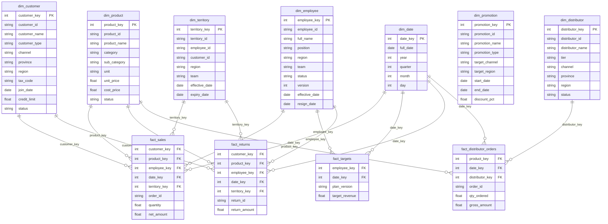

# 🌟 VietDist Gold Layer: Star Schema Design (Kimball) — Grain Statements

**Ticket:** VDAP-392 (bd `vietdist-analytics-platform-a9l.9.1`)
**Nguồn dữ liệu xác nhận:** `data/silver/20260804/*.parquet` (đọc trực tiếp bằng Polars, không đoán)

## 🎯 Mục đích

Trước khi code Gold layer (Phase 3), xác định rõ ràng grain (đơn vị 1 dòng)
của từng Fact table dựa trên dữ liệu Silver thật. Grain sai sẽ khiến mọi
phép `JOIN`/`group_by` sau này (đặc biệt `mart_sales_vs_target`) tính sai
mà không biết tại sao.

## fact_sales

- **Nguồn Silver:** `sales_transactions` (`SRC01_sales_transactions.parquet`)
- **Business key:** `(order_id, product_id)`
- **Grain statement:** 1 dòng = 1 sản phẩm (line item) trong 1 đơn hàng bán.
  Một đơn hàng (`order_id`) có thể chứa nhiều sản phẩm khác nhau, mỗi sản
  phẩm là 1 dòng riêng.
- **Xác nhận bằng data:** 119,101 dòng, 50,000 `order_id` distinct
  (trung bình ~2.4 sản phẩm/đơn), cặp `(order_id, product_id)` có 119,101
  giá trị distinct — khớp đúng số dòng, xác nhận unique.

## fact_targets

- **Nguồn Silver:** `sales_target_plan` (`SRC02_sales_target_plan.parquet`)
- **Business key:** `(employee_id, year, month)`
- **Grain statement:** 1 dòng = chỉ tiêu doanh số của 1 nhân viên trong 1
  tháng.
- **Xác nhận bằng data:** 1,332 dòng = 111 `employee_id` distinct × 12
  tháng. Cặp `(employee_id, year, month)` có 1,332 giá trị distinct —
  khớp đúng số dòng, xác nhận unique, không có trùng.
- **⚠️ Quan trọng — xác nhận lại giả định P3.3:** Target được set **theo
  nhân viên (`employee_id`)**, KHÔNG phải theo `region` hay `team`. Dữ
  liệu có cột `region`/`team` nhưng chúng là thuộc tính mô tả đi kèm
  nhân viên đó tại thời điểm lập kế hoạch, không phải business key. Nếu
  P3.3 code `join`/`group_by` theo `region` sẽ SAI vì nhiều nhân viên
  cùng region sẽ bị cộng dồn target sai lệch. Khi build `fact_targets`,
  surrogate key tra cứu Dimension phải đi qua `employee_id`.

## fact_returns

- **Nguồn Silver:** `return_transactions` (`SRC09_return_transactions.parquet`)
- **Business key:** `return_id`
- **Grain statement:** 1 dòng = 1 lần trả hàng (1 sản phẩm bị trả trong 1
  giao dịch trả hàng).
- **Xác nhận bằng data:** 3,665 dòng, 3,665 `return_id` distinct — unique
  1-1, không có trường hợp 1 `return_id` gồm nhiều sản phẩm (multi-line)
  như `fact_sales`.

## fact_distributor_orders

- **Nguồn Silver:** `distributor_orders` (`SRC05_distributor_orders.parquet`)
- **Business key:** `(order_id, product_id)`
- **Grain statement:** 1 dòng = 1 sản phẩm (line item) trong 1 đơn đặt
  hàng của nhà phân phối. Cùng pattern với `fact_sales`: 1 đơn đặt hàng
  NPP có thể gồm nhiều sản phẩm.
- **Xác nhận bằng data:** 35,945 dòng, 8,000 `order_id` distinct (trung
  bình ~4.5 sản phẩm/đơn), cặp `(order_id, product_id)` có 35,945 giá
  trị distinct — khớp đúng số dòng, xác nhận unique.

## Tóm tắt

| Fact | Business key | Grain |
|---|---|---|
| `fact_sales` | `(order_id, product_id)` | 1 dòng = 1 sản phẩm / 1 đơn hàng bán |
| `fact_targets` | `(employee_id, year, month)` | 1 dòng = chỉ tiêu 1 nhân viên / 1 tháng |
| `fact_returns` | `return_id` | 1 dòng = 1 lần trả hàng |
| `fact_distributor_orders` | `(order_id, product_id)` | 1 dòng = 1 sản phẩm / 1 đơn đặt hàng NPP |

## Bus Matrix — Business Process × Dimension

**Ticket:** VDAP-393 (bd `vietdist-analytics-platform-a9l.9.2`)
**Nguồn xác nhận:** cột FK thật trong `data/silver/20260804/{SRC01,SRC02,SRC05,SRC09}*.parquet`, đối chiếu khóa tự nhiên của 6 Dimension source (`SRC03,04,06,07,08,10`). Date dimension không có source riêng, derive từ cột ngày trên từng fact.

### Ma trận

| Process | Customer | Product | Employee | Date | Territory | Promotion | Distributor |
|---|---|---|---|---|---|---|---|
| fact_sales | X | X | X | X | X | | |
| fact_targets | | | X | X | | | |
| fact_returns | X | X | X | X | X | | |
| fact_distributor_orders | | X | | X | | | X |

### Giải thích từng process

- **fact_sales:** có sẵn `customer_id`, `product_id`, `employee_id`, `order_date` → FK trực tiếp tới Customer, Product, Employee, Date. Có cả `employee_id` lẫn `customer_id` cùng lúc — đây đúng là cặp khóa tự nhiên của `territory_mapping` (`employee_id`+`customer_id`, có `effective_date`/`expiry_date`) → join được Territory dimension để tra cứu vùng phụ trách tại thời điểm bán. Không có `promotion_id` hay `distributor_id` trong nguồn → Promotion, Distributor để trống.
- **fact_targets:** chỉ có `employee_id` + `year`/`month` (Date ở mức tháng) → Employee, Date có X. Không có `customer_id`/`product_id`/`distributor_id` → Customer/Product/Distributor trống. Vì `territory_mapping` cần cả `employee_id` VÀ `customer_id` mới xác định đúng 1 territory — nếu chỉ join bằng `employee_id` sẽ fan-out ra nhiều customer/territory của employee đó → Territory để trống, không đánh X.
- **fact_returns:** có `customer_id`, `product_id`, `employee_id`, `return_date` — giống hệt pattern `fact_sales` → Customer, Product, Employee, Date, Territory đều X (lý do Territory giống fact_sales). Promotion, Distributor trống.
- **fact_distributor_orders:** có `product_id`, `distributor_id`, `order_date` → Product, Date, Distributor có X. Không có `employee_id`/`customer_id` → Customer, Employee trống. Territory trống vì thiếu cả 2 cột khóa cần thiết (`employee_id` và `customer_id`) — territory_mapping vốn mô tả vùng phụ trách của nhân viên bán hàng với khách hàng, không áp dụng cho quan hệ nhà phân phối.

### Conformed Dimensions (dùng ≥2 quy trình)

- **Date** — dùng ở cả 4 process (mọi giao dịch đều có mốc thời gian).
- **Product** — 3 process: fact_sales, fact_returns, fact_distributor_orders.
- **Employee** — 3 process: fact_sales, fact_targets, fact_returns.
- **Customer** — 2 process: fact_sales, fact_returns.
- **Territory** — 2 process: fact_sales, fact_returns.

### Không conformed / chưa xác định

- **Distributor** — chỉ 1 process (fact_distributor_orders), không conformed.
- **Promotion — ⚠️ gap cần design riêng:** không có process nào trong 4 fact hiện tại chứa cột `promotion_id` hay bất kỳ khóa cứng nào trỏ tới `promotion_program`. Nguồn `promotion_program` chỉ mô tả phạm vi áp dụng qua `target_channel`, `target_region`, `applicable_products`, `start_date`/`end_date` — đây là điều kiện business-rule (channel + region + date-range + product nằm trong danh sách), không phải 1 cột FK trực tiếp trên `fact_sales`. Vì AC ticket này yêu cầu "không đoán", KHÔNG đánh X cho Promotion ở bus matrix hiện tại. Việc thiết kế join Promotion (dạng bridge table hay business-rule join) cần 1 quyết định thiết kế riêng, ngoài scope VDAP-393 — nên xử lý ở subtask kế tiếp trước khi build Gold layer thật.

## ERD — Star Schema (Mermaid)

**Ticket:** VDAP-394 (bd `vietdist-analytics-platform-a9l.9.3`)
**Nguồn xác nhận:** cột thật trong `data/silver/20260804/*.parquet` (10 nguồn). Số quan hệ FK vẽ dưới đây khớp 100% với Bus Matrix ở section trên (15/15 line: fact_sales 5, fact_targets 2, fact_returns 5, fact_distributor_orders 3).

### Ghi chú

- **`dim_promotion` không có relationship line:** đúng theo Bus Matrix ở trên — không fact nào trong 4 fact hiện tại có `promotion_id`/FK trực tiếp tới `promotion_program`. Dimension vẫn khai báo đủ (đúng AC "4 Fact + 7 Dim") để không mất thông tin cấu trúc, nhưng việc join thật (qua business-rule channel/region/date-range/product-list) cần 1 quyết định thiết kế riêng trước khi build Gold layer — xem chi tiết ở section Bus Matrix phía trên.
- **Unknown Member (-1):** quy ước Kimball chung cho mọi surrogate key FK trên các bảng Fact — khi lookup theo natural key (VD `employee_id`, `customer_id`, `product_id`) mà không tìm thấy dòng khớp trong Dimension tại thời điểm giao dịch (dữ liệu trễ, dim SCD2 hết hiệu lực, hoặc lỗi nguồn), gán surrogate key = `-1` (dòng "Unknown Member" thêm sẵn trong mỗi Dim) thay vì để `NULL`. Mục đích: `INNER JOIN` giữa Fact và Dim không bị rớt dòng, giữ đúng grain đã xác nhận ở section Grain Statements.
